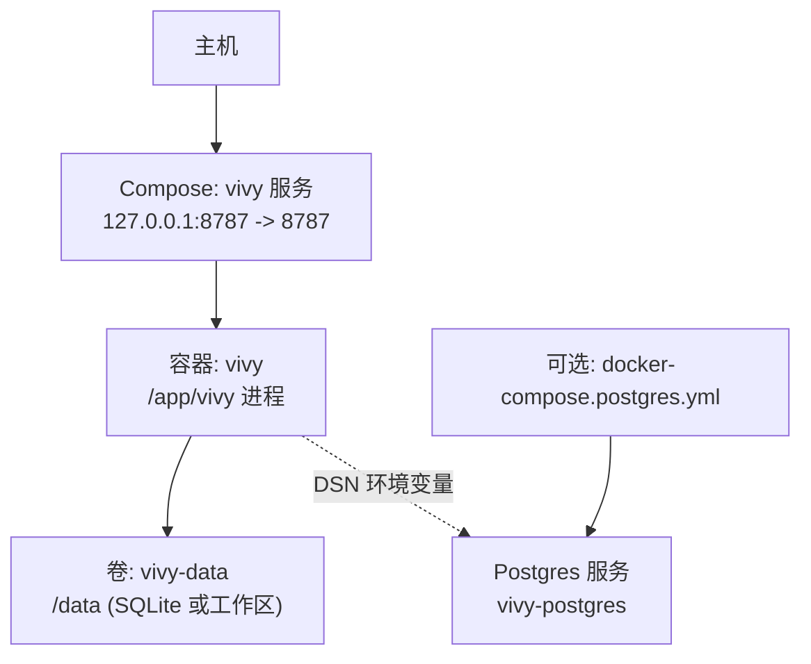
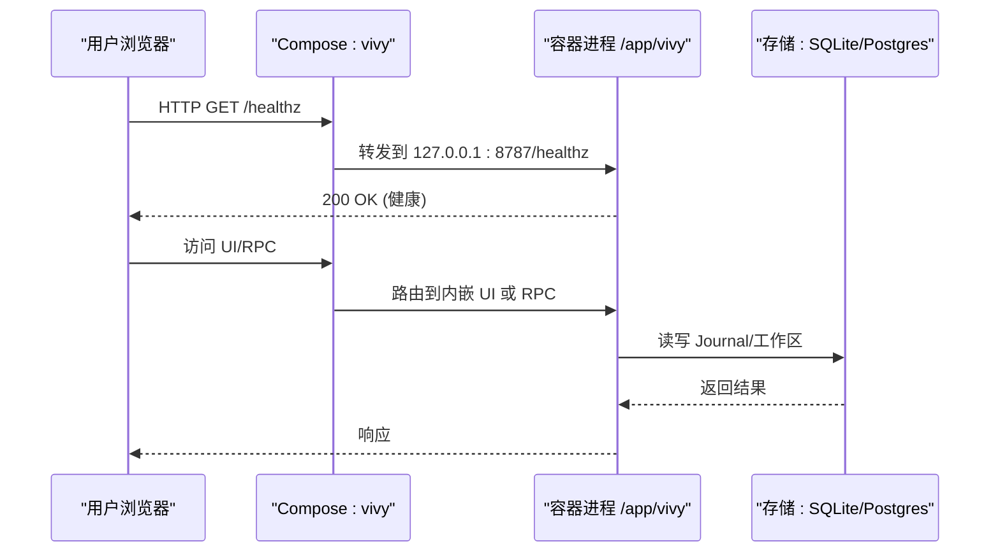
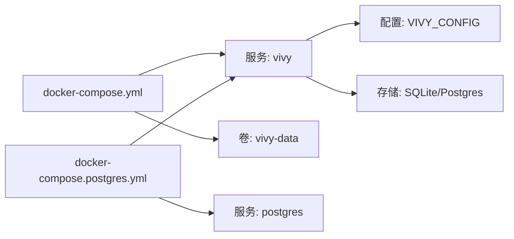

# 基础服务配置

<cite>
**本文引用的文件**
- [docker-compose.yml](file://docker-compose.yml)
- [docker-compose.postgres.yml](file://docker-compose.postgres.yml)
- [Dockerfile](file://Dockerfile)
- [config.example.yaml](file://config.example.yaml)
- [config.dev.yaml](file://config.dev.yaml)
- [docker/config.yaml](file://docker/config.yaml)
- [docker/config.postgres.yaml](file://docker/config.postgres.yaml)
- [dev.ps1](file://dev.ps1)
- [justfile](file://justfile)
- [README.md](file://README.md)
</cite>

## 目录
1. [简介](#简介)
2. [项目结构](#项目结构)
3. [核心组件](#核心组件)
4. [架构总览](#架构总览)
5. [详细组件分析](#详细组件分析)
6. [依赖关系分析](#依赖关系分析)
7. [性能与可观测性](#性能与可观测性)
8. [故障排查指南](#故障排查指南)
9. [结论](#结论)
10. [附录](#附录)

## 简介
本文件聚焦 Vivy 基础服务的 Compose 与容器化配置，覆盖构建参数（GOPROXY、NPM_REGISTRY）、镜像构建流程、容器命名与重启策略、端口映射安全绑定、数据卷持久化、环境变量注入（时区、API 密钥）、健康检查与健康重试策略，以及开发环境最佳实践（热重载、调试模式、日志级别）。同时提供常见问题定位与解决建议。

## 项目结构
Vivy 以单容器形态运行：Go 后端 + 内嵌 UI，默认使用 SQLite 存储于 /data 目录；可选叠加 Postgres 作为第二个 Journal 引擎。Compose 仅暴露本地回环地址的 8787 端口，确保控制平面不对外网开放。

图表来源
- [docker-compose.yml:6-29](file://docker-compose.yml#L6-L29)
- [docker-compose.postgres.yml:4-31](file://docker-compose.postgres.yml#L4-L31)

章节来源
- [docker-compose.yml:1-33](file://docker-compose.yml#L1-L33)
- [docker-compose.postgres.yml:1-35](file://docker-compose.postgres.yml#L1-L35)
- [README.md:44-58](file://README.md#L44-L58)

## 核心组件
- 构建参数与镜像
  - GOPROXY 与 NPM_REGISTRY 通过构建参数传入，用于加速 Go 模块下载与前端资源安装。
  - 多阶段构建：Node 构建 UI，Go 编译二进制，最终产物为精简 Debian 镜像。
- 服务定义
  - 容器名：viv y；镜像：vivy:local；重启策略：unless-stopped。
  - 端口：仅绑定 127.0.0.1:8787，避免外网暴露。
  - 数据卷：vivy-data:/data，持久化 Journal 与工作区。
  - 环境变量：TZ、OPENAI_API_KEY、ANTHROPIC_API_KEY。
  - 健康检查：HTTP GET /healthz，间隔/超时/重试/启动宽限期。
- 可选 Postgres 叠加
  - 通过 docker-compose.postgres.yml 引入 postgres 服务，设置 VIVY_CONFIG 指向 Postgres 配置，并通过 VIVY_POSTGRES_DSN 注入连接串。

章节来源
- [docker-compose.yml:7-29](file://docker-compose.yml#L7-L29)
- [docker-compose.postgres.yml:4-31](file://docker-compose.postgres.yml#L4-L31)
- [Dockerfile:4-47](file://Dockerfile#L4-L47)

## 架构总览
Vivy 在容器中以单进程运行，监听 8787 端口，提供 HTTP 与 WebSocket JSON-RPC 控制面。UI 内嵌于二进制中或通过 Vite 分离开发。存储默认 SQLite，位于 /data；可选切换至 Postgres，但保持 replica=1，禁止多副本共享同一 DSN。

图表来源
- [docker-compose.yml:16-29](file://docker-compose.yml#L16-L29)
- [Dockerfile:40-47](file://Dockerfile#L40-L47)
- [docker/config.yaml:5-18](file://docker/config.yaml#L5-L18)
- [docker/config.postgres.yaml:4-18](file://docker/config.postgres.yaml#L4-L18)

## 详细组件分析

### 构建参数与镜像配置
- 构建参数
  - GOPROXY：Go 模块代理，默认 goproxy.cn,direct，提升国内网络下载速度。
  - NPM_REGISTRY：前端 pnpm 包源，默认 npmmirror，加速 UI 依赖安装。
- 多阶段构建
  - ui 阶段：基于 node:22-bookworm-slim，启用 corepack/pnpm，安装并构建前端静态资源。
  - build 阶段：基于 golang:1.26-bookworm，设置 CGO_ENABLED=0，裁剪二进制，输出 /out/vivy。
  - 运行阶段：debian:bookworm-slim，安装必要系统包，复制二进制与配置文件，暴露 8787，声明 /data 卷，内置 HEALTHCHECK。
- 环境变量
  - VIVY_CONFIG：默认 /app/docker/config.yaml，可通过 Compose 覆盖为 Postgres 配置。
  - VIVY_ADDR：默认 0.0.0.0:8787（容器内监听），由 Compose 端口映射限制为 127.0.0.1。
  - TZ：Asia/Shanghai，统一时区。

章节来源
- [Dockerfile:4-47](file://Dockerfile#L4-L47)
- [docker/config.yaml:5-18](file://docker/config.yaml#L5-L18)
- [docker/config.postgres.yaml:4-18](file://docker/config.postgres.yaml#L4-L18)

### 容器命名与重启策略
- 容器名：viv y，便于识别与管理。
- 重启策略：unless-stopped，保证异常退出后自动恢复，除非手动停止。

章节来源
- [docker-compose.yml:13-15](file://docker-compose.yml#L13-L15)

### 端口映射的安全考虑
- 仅绑定 127.0.0.1:8787，防止 /rpc/bootstrap 等无鉴权端点被外网访问。
- 容器内监听 0.0.0.0:8787，由 Docker 端口映射限制为本地回环。

章节来源
- [docker-compose.yml:16-17](file://docker-compose.yml#L16-L17)
- [Dockerfile:41-43](file://Dockerfile#L41-L43)
- [README.md:44-52](file://README.md#L44-L52)

### 数据卷挂载机制（/data 持久化）
- 命名卷 vivy-data 挂载到 /data，持久化 SQLite 数据库与工作区、技能包等。
- 默认 SQLite 路径：/data/vivy.db；工作区与技能根目录也位于 /data 下。
- 使用 Postgres 时，/data 仍可用于工作区与技能根目录，数据库由外部 Postgres 管理。

章节来源
- [docker-compose.yml:18-19](file://docker-compose.yml#L18-L19)
- [docker/config.yaml:9-18](file://docker/config.yaml#L9-L18)
- [docker/config.postgres.yaml:8-18](file://docker/config.postgres.yaml#L8-L18)

### 环境变量配置（时区、API 密钥注入）
- TZ：Asia/Shanghai，统一日志与时间戳。
- OPENAI_API_KEY、ANTHROPIC_API_KEY：从宿主机环境变量注入，运行时读取，不写入配置或快照。
- 可选：VIVY_CONFIG 指向 Postgres 配置；VIVY_POSTGRES_DSN 注入数据库连接串。

章节来源
- [docker-compose.yml:20-23](file://docker-compose.yml#L20-L23)
- [docker-compose.postgres.yml:26-31](file://docker-compose.postgres.yml#L26-L31)
- [config.example.yaml:23-35](file://config.example.yaml#L23-L35)

### 健康检查配置（HTTP 端点检测、重试策略）
- 健康检查命令：wget 请求 http://127.0.0.1:8787/healthz，成功即认为就绪。
- 参数：interval=10s，timeout=3s，retries=5，start_period=20s，适合冷启动与初始化。
- 该健康检查同时存在于镜像与 Compose，确保编排层与应用层一致。

章节来源
- [docker-compose.yml:24-29](file://docker-compose.yml#L24-L29)
- [Dockerfile:45-46](file://Dockerfile#L45-L46)

### 开发环境最佳实践
- 热重载与分离式开发
  - 使用 dev.ps1 或 just dev 启动后端 :8787 与 Vite UI :3015，实现前后端独立热重载。
  - 若未设置 API 密钥，自动加载 config.dev.yaml 启用 mock 模式，便于离线开发。
- 调试模式
  - 通过 config.dev.yaml 开启 runtime.mock=true，配合测试场景进行断点与回放。
- 日志级别调整
  - 可在运行时通过环境变量或配置项调整日志级别（具体字段参考应用配置），Compose 中通过 VIVY_CONFIG 切换不同环境配置。

章节来源
- [dev.ps1:117-124](file://dev.ps1#L117-L124)
- [config.dev.yaml:4-6](file://config.dev.yaml#L4-L6)
- [justfile:45-57](file://justfile#L45-L57)

## 依赖关系分析
- Compose 服务依赖
  - vivy 服务依赖 Postgres（可选），通过 depends_on 与 condition: service_healthy 确保顺序启动。
- 配置依赖
  - 默认 SQLite：docker/config.yaml；Postgres：docker/config.postgres.yaml，通过 VIVY_CONFIG 切换。
- 存储依赖
  - SQLite：/data/vivy.db；Postgres：通过 VIVY_POSTGRES_DSN 注入连接串。

图表来源
- [docker-compose.yml:6-29](file://docker-compose.yml#L6-L29)
- [docker-compose.postgres.yml:4-31](file://docker-compose.postgres.yml#L4-L31)
- [docker/config.yaml:5-18](file://docker/config.yaml#L5-L18)
- [docker/config.postgres.yaml:4-18](file://docker/config.postgres.yaml#L4-L18)

章节来源
- [docker-compose.yml:6-29](file://docker-compose.yml#L6-L29)
- [docker-compose.postgres.yml:4-31](file://docker-compose.postgres.yml#L4-L31)

## 性能与可观测性
- 健康检查
  - 短超时与合理重试，避免误判；启动宽限期应对冷启动耗时。
- 存储选择
  - SQLite 适合单机与轻量负载；Postgres 适合更高并发与外部化管理。
- 网络与安全
  - 仅本地回环暴露，降低攻击面；敏感信息通过环境变量注入，不落盘。

[本节为通用指导，无需特定文件引用]

## 故障排查指南
- 构建失败
  - 现象：Go 模块下载慢或失败；前端依赖安装失败。
  - 原因：GOPROXY/NPM_REGISTRY 不可达或缓存问题。
  - 处理：确认代理地址可用；清理缓存后重试；检查网络连通性。
  - 参考：构建参数与镜像阶段。
- 端口冲突
  - 现象：启动时报 8787 或 3015 端口占用。
  - 原因：已有 Vivy 或 Vite 进程占用端口。
  - 处理：结束占用进程；修改端口或等待释放；使用脚本端口检测提示。
  - 参考：开发脚本端口检查逻辑。
- 权限问题
  - 现象：无法写入 /data 或数据库文件。
  - 原因：卷权限不足或 SELinux/AppArmor 限制。
  - 处理：检查宿主目录权限；必要时调整卷挂载选项；确认容器用户权限。
- 健康检查失败
  - 现象：容器反复重启或标记不健康。
  - 原因：/healthz 不可用或启动过慢。
  - 处理：检查应用日志；适当增大 start_period；确认端口绑定与防火墙。
- Postgres 连接失败
  - 现象：无法切换到 Postgres 存储。
  - 原因：DSN 错误或数据库未就绪。
  - 处理：校验 VIVY_POSTGRES_DSN；确认 Postgres 服务健康；检查网络与凭据。

章节来源
- [dev.ps1:98-103](file://dev.ps1#L98-L103)
- [docker-compose.yml:24-29](file://docker-compose.yml#L24-L29)
- [docker-compose.postgres.yml:15-20](file://docker-compose.postgres.yml#L15-L20)

## 结论
Vivy 的基础服务配置以安全、简洁、可维护为核心：仅暴露本地回环端口，使用命名卷持久化数据，通过环境变量注入敏感信息，并提供健壮的健康检查与重启策略。开发环境支持热重载与 mock 模式，生产环境可选择 Postgres 以提升可扩展性。遵循上述配置与实践，可快速搭建稳定可靠的 Vivy 运行环境。

[本节为总结性内容，无需特定文件引用]

## 附录
- 常用命令
  - 构建镜像：just docker-build
  - 启动容器：just docker-up
  - 启动带 Postgres：just docker-up-postgres
  - 开发模式：just dev 或 ./dev.ps1
- 关键路径
  - 配置文件：docker/config.yaml、docker/config.postgres.yaml
  - 示例配置：config.example.yaml、config.dev.yaml
  - 健康端点：http://127.0.0.1:8787/healthz

章节来源
- [justfile:49-57](file://justfile#L49-L57)
- [dev.ps1:117-131](file://dev.ps1#L117-L131)
- [docker/config.yaml:5-18](file://docker/config.yaml#L5-L18)
- [docker/config.postgres.yaml:4-18](file://docker/config.postgres.yaml#L4-L18)
- [config.example.yaml:1-35](file://config.example.yaml#L1-L35)
- [config.dev.yaml:4-6](file://config.dev.yaml#L4-L6)