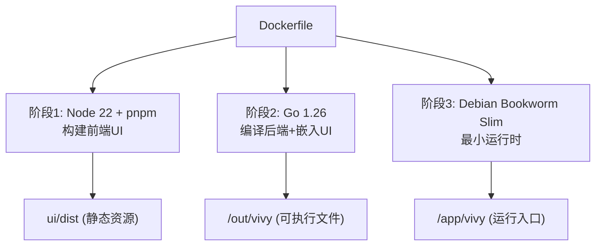
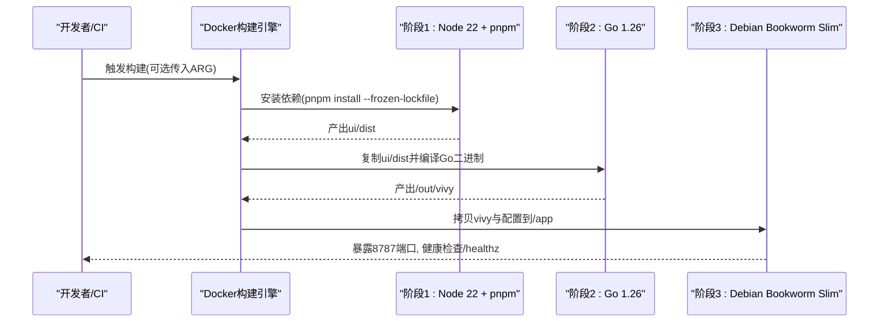
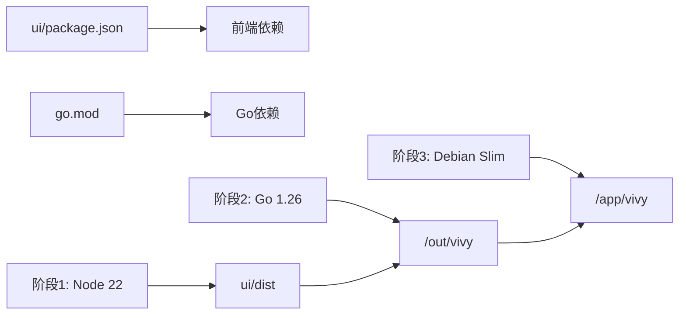

# Docker镜像构建

<cite>
**本文引用的文件**
- [Dockerfile](file://Dockerfile)
- [.dockerignore](file://.dockerignore)
- [go.mod](file://go.mod)
- [ui/package.json](file://ui/package.json)
- [ui/.npmrc](file://ui/.npmrc)
- [ui/embed.go](file://ui/embed.go)
- [docker/config.yaml](file://docker/config.yaml)
</cite>

## 目录
1. [简介](#简介)
2. [项目结构](#项目结构)
3. [核心组件](#核心组件)
4. [架构总览](#架构总览)
5. [详细组件分析](#详细组件分析)
6. [依赖关系分析](#依赖关系分析)
7. [性能与体积优化](#性能与体积优化)
8. [故障排查指南](#故障排查指南)
9. [结论](#结论)
10. [附录：本地构建与CI/CD集成](#附录本地构建与cicd集成)

## 简介
本仓库采用三阶段多阶段Docker构建，将前端React UI与后端Go服务打包进单一可执行镜像中。构建目标包括：
- 第一阶段：使用Node.js 22构建React前端UI，配置pnpm包管理器与npm镜像源，输出静态资源到ui/dist。
- 第二阶段：使用Go 1.26编译后端服务，禁用CGO并启用链接优化参数，将前端静态资源嵌入二进制。
- 第三阶段：基于Debian Bookworm最小化运行时镜像，仅包含运行所需系统库、证书与时区数据。

文档将详细说明每个阶段的依赖安装、缓存优化、安全最佳实践，环境变量配置（GOPROXY、NPM_REGISTRY）、构建参数传递、镜像大小优化策略，并提供本地构建命令与CI/CD集成示例。

## 项目结构
与镜像构建直接相关的顶层文件与目录：
- Dockerfile：定义三阶段构建流程、环境变量、构建参数与运行入口。
- .dockerignore：排除不必要的上下文文件，减少构建上下文体积。
- ui/package.json：前端依赖与脚本定义。
- ui/.npmrc：默认npm镜像源。
- go.mod：Go模块与依赖声明。
- ui/embed.go：通过embed将ui/dist内嵌到Go二进制中。
- docker/config.yaml：容器内运行时配置（存储路径、监听地址等）。

图表来源
- [Dockerfile:1-48](file://Dockerfile#L1-L48)

章节来源
- [Dockerfile:1-48](file://Dockerfile#L1-L48)
- [.dockerignore:1-37](file://.dockerignore#L1-L37)

## 核心组件
- 构建参数与环境变量
  - ARG GOPROXY：控制Go模块下载代理，默认值为国内镜像。
  - ARG NPM_REGISTRY：控制npm/pnpm镜像源，默认值为国内镜像。
  - ENV COREPACK_ENABLE_DOWNLOAD_PROMPT=0：禁用Corepack下载提示。
  - ENV PLAYWRIGHT_SKIP_BROWSER_DOWNLOAD=1：跳过Playwright浏览器下载，避免在构建阶段拉取额外二进制。
  - ENV CGO_ENABLED=0：禁用CGO，生成纯Go静态二进制，提升可移植性。
  - ENV GO111MODULE=on：启用Go Modules。
  - ENV VIVY_CONFIG=/app/docker/config.yaml：指定配置文件路径。
  - ENV VIVY_ADDR=0.0.0.0:8787：监听地址与端口。
  - ENV TZ=Asia/Shanghai：设置时区。

- 构建产物
  - 前端：ui/dist（由Vite构建的静态资源）。
  - 后端：/out/vivy（Go编译的二进制）。
  - 运行时：/app/vivy（最终镜像中的可执行文件）。

章节来源
- [Dockerfile:4-47](file://Dockerfile#L4-L47)
- [ui/embed.go:1-23](file://ui/embed.go#L1-L23)
- [docker/config.yaml:1-19](file://docker/config.yaml#L1-L19)

## 架构总览
三阶段构建的整体流程如下：

图表来源
- [Dockerfile:7-47](file://Dockerfile#L7-L47)

## 详细组件分析

### 阶段一：前端构建（Node.js 22 + pnpm）
- 基础镜像：node:22-bookworm-slim
- 关键步骤
  - 启用Corepack并激活pnpm特定版本，确保包管理器一致性。
  - 设置NPM_REGISTRY为镜像源，并通过pnpm config set registry应用。
  - 使用--frozen-lockfile锁定依赖安装，保证可重复构建。
  - 构建前端产物到ui/dist。
- 缓存优化
  - 先COPY package.json与pnpm-lock.yaml，再安装依赖，利用Docker层缓存加速。
  - 使用pnpm-lock.yaml与--frozen-lockfile确保依赖树稳定。
- 安全与稳定性
  - 设置COREPACK_ENABLE_DOWNLOAD_PROMPT=0避免交互式提示。
  - 设置PLAYWRIGHT_SKIP_BROWSER_DOWNLOAD=1避免在构建阶段下载测试浏览器。
  - 允许所有构建脚本（dangerouslyAllowAllBuilds true），但建议仅在可信环境中使用。

章节来源
- [Dockerfile:7-19](file://Dockerfile#L7-L19)
- [ui/package.json:1-82](file://ui/package.json#L1-L82)
- [ui/.npmrc:1-2](file://ui/.npmrc#L1-L2)

### 阶段二：后端编译（Go 1.26）
- 基础镜像：golang:1.26-bookworm
- 关键步骤
  - 设置CGO_ENABLED=0，禁用CGO，生成静态二进制。
  - 设置GO111MODULE=on与GOPROXY，控制模块下载。
  - 先COPY go.mod/go.sum并执行go mod download，利用缓存加速后续构建。
  - COPY全部源码，并从阶段一复制ui/dist到./ui/dist。
  - 使用go build -trimpath -ldflags "-s -w"编译，去除调试信息与符号表，减小体积。
- 嵌入前端
  - 通过ui/embed.go中的//go:embed指令将ui/dist内嵌到二进制中，运行时无需外部静态资源。
- 安全与稳定性
  - 禁用CGO减少外部依赖与潜在漏洞面。
  - 使用-trimpath与-lsflags "-s -w"优化二进制体积与安全性（移除路径与符号信息）。

章节来源
- [Dockerfile:21-29](file://Dockerfile#L21-L29)
- [ui/embed.go:1-23](file://ui/embed.go#L1-L23)
- [go.mod:1-59](file://go.mod#L1-L59)

### 阶段三：运行时镜像（Debian Bookworm Slim）
- 基础镜像：debian:bookworm-slim
- 关键步骤
  - 安装最小必要系统包：ca-certificates、tzdata、wget（用于健康检查）。
  - 清理apt列表以减小镜像体积。
  - 从阶段二复制vivy到/app/vivy。
  - 复制docker/config.yaml与fixtures/provider到镜像中。
  - 设置环境变量：VIVY_CONFIG、VIVY_ADDR、TZ。
  - 暴露8787端口，挂载/data卷持久化数据。
  - 配置HEALTHCHECK使用wget探测/healthz。
  - ENTRYPOINT指向/app/vivy。
- 安全与稳定性
  - 使用--no-install-recommends仅安装必需包。
  - 清理/var/lib/apt/lists/*减少镜像体积。
  - 仅暴露必要端口，限制网络暴露面。

章节来源
- [Dockerfile:31-47](file://Dockerfile#L31-L47)
- [docker/config.yaml:1-19](file://docker/config.yaml#L1-L19)

## 依赖关系分析
- 前端依赖
  - 通过ui/package.json声明React、Vite、Tailwind等依赖。
  - 使用pnpm-lock.yaml锁定依赖版本，确保构建可重复。
- 后端依赖
  - 通过go.mod声明Go模块与依赖，包括cloudwego/eino、gorilla/websocket、sqlite等。
- 构建期依赖
  - Node.js 22与pnpm用于前端构建。
  - Go 1.26用于后端编译。
- 运行期依赖
  - Debian Bookworm Slim提供最小系统环境。
  - ca-certificates用于HTTPS通信。
  - tzdata用于时区处理。
  - wget用于健康检查。

图表来源
- [ui/package.json:1-82](file://ui/package.json#L1-L82)
- [go.mod:1-59](file://go.mod#L1-L59)
- [Dockerfile:7-47](file://Dockerfile#L7-L47)

章节来源
- [ui/package.json:1-82](file://ui/package.json#L1-L82)
- [go.mod:1-59](file://go.mod#L1-L59)
- [Dockerfile:7-47](file://Dockerfile#L7-L47)

## 性能与体积优化
- 构建缓存优化
  - 前端：先COPY package.json与pnpm-lock.yaml，再安装依赖，最大化利用Docker层缓存。
  - 后端：先COPY go.mod/go.sum并执行go mod download，再COPY源码，加速依赖下载与编译。
- 二进制优化
  - 使用-trimpath移除构建路径信息。
  - 使用-lsflags "-s -w"移除符号表与调试信息，显著减小二进制体积。
- 镜像体积优化
  - 使用bookworm-slim基础镜像减少系统包体积。
  - 使用--no-install-recommends仅安装必需包。
  - 清理apt列表与临时文件。
- 安全最佳实践
  - 禁用CGO减少攻击面。
  - 仅暴露必要端口（8787）。
  - 使用只读文件系统原则（除/data卷外）。
  - 通过HEALTHCHECK监控服务健康状态。

章节来源
- [Dockerfile:21-47](file://Dockerfile#L21-L47)

## 故障排查指南
- 构建失败：依赖下载问题
  - 检查GOPROXY与NPM_REGISTRY是否正确配置。
  - 确认网络可达性与代理设置。
- 前端构建失败：pnpm安装错误
  - 确认pnpm-lock.yaml与package.json一致。
  - 尝试删除pnpm-store后重试。
- 后端编译失败：CGO相关错误
  - 确认CGO_ENABLED=0已设置。
  - 检查是否有C依赖未正确禁用。
- 运行时启动失败：端口占用或权限问题
  - 检查8787端口是否被占用。
  - 确认/data卷具有写入权限。
- 健康检查失败：/healthz不可访问
  - 确认服务已启动并监听正确地址。
  - 检查防火墙与安全组规则。

章节来源
- [Dockerfile:4-47](file://Dockerfile#L4-L47)

## 结论
该Docker镜像构建采用三阶段多阶段构建，实现了前后端分离构建与统一打包。通过合理的依赖管理、缓存优化与安全配置，确保了构建的可重复性、镜像的小体积与运行时的安全性。环境变量与构建参数的灵活配置，使得在不同环境下（开发、CI/CD）都能获得一致的构建结果。

## 附录：本地构建与CI/CD集成

### 本地构建命令
- 基本构建
  - docker build -t vivy:latest .
- 自定义镜像源
  - docker build --build-arg NPM_REGISTRY=https://registry.npmmirror.com --build-arg GOPROXY=https://goproxy.cn,direct -t vivy:latest .
- 指定构建上下文
  - docker build -f Dockerfile -t vivy:latest .

### CI/CD集成示例
- GitHub Actions
  - 设置GOPROXY与NPM_REGISTRY环境变量。
  - 使用docker/build-push-action进行构建与推送。
  - 缓存Docker层与pnpm依赖。
- GitLab CI
  - 配置GitLab Container Registry。
  - 使用cache关键字缓存pnpm-store与Go模块缓存。
  - 并行构建前端与后端以提升效率。

章节来源
- [Dockerfile:4-47](file://Dockerfile#L4-L47)