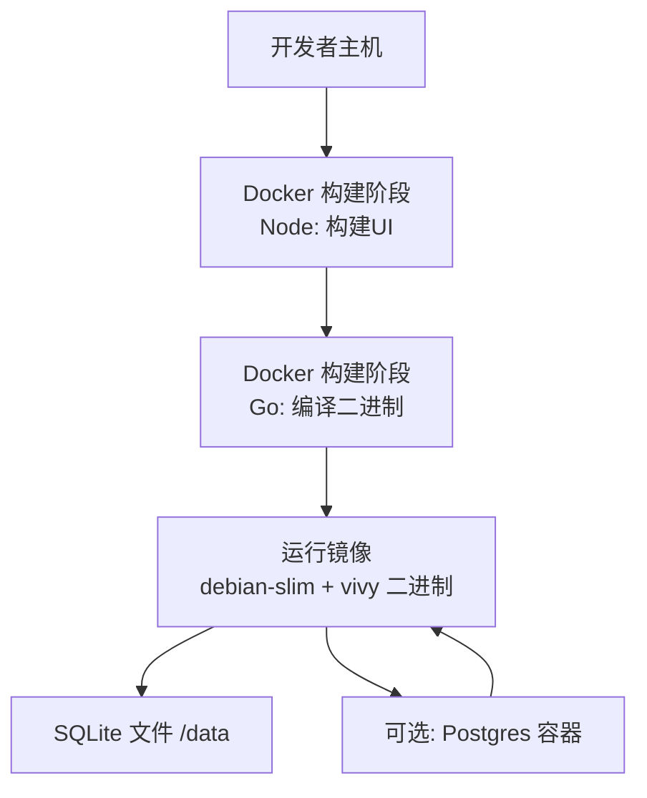
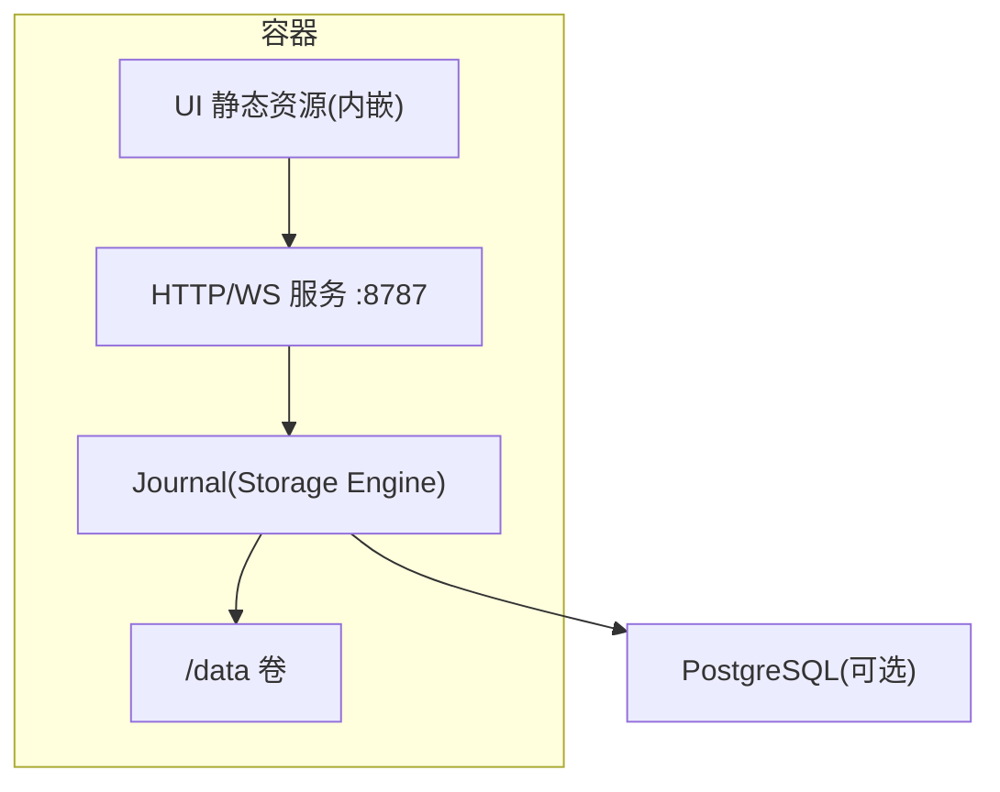
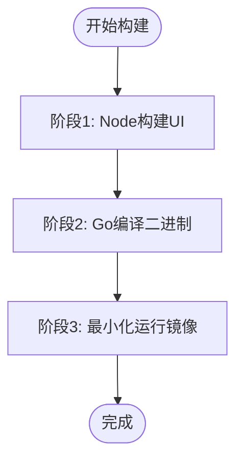
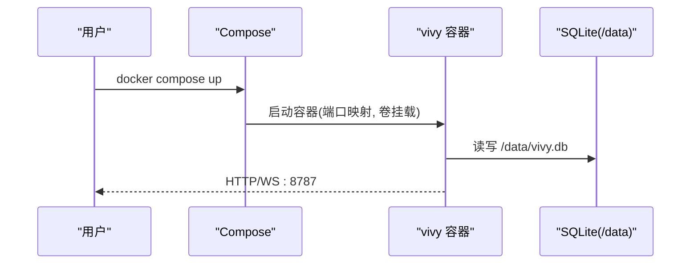
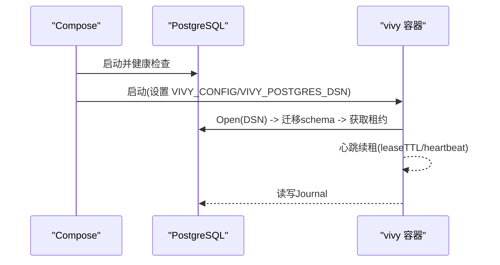
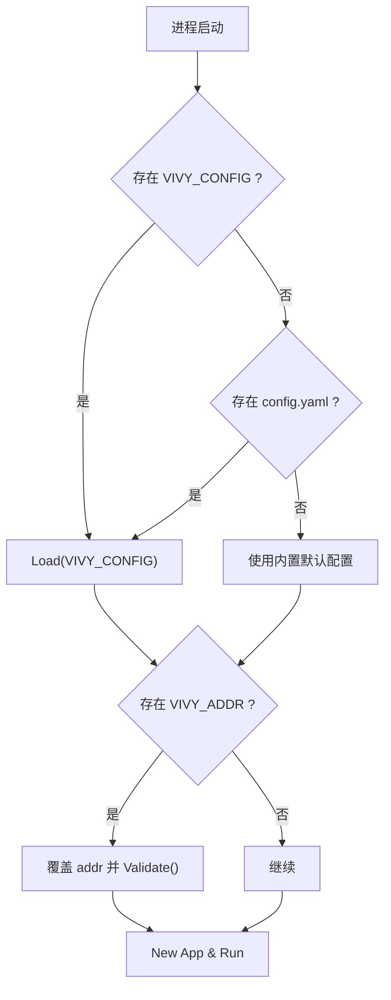
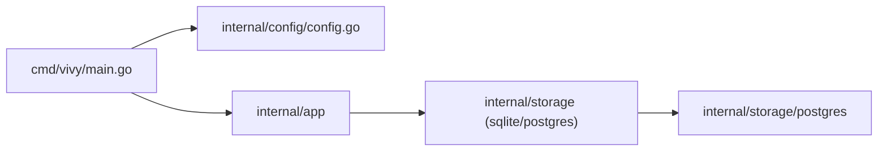

# 容器化部署

<cite>
**本文引用的文件**
- [Dockerfile](file://Dockerfile)
- [docker-compose.yml](file://docker-compose.yml)
- [docker-compose.postgres.yml](file://docker-compose.postgres.yml)
- [docker/config.yaml](file://docker/config.yaml)
- [docker/config.postgres.yaml](file://docker/config.postgres.yaml)
- [config.example.yaml](file://config.example.yaml)
- [internal/config/config.go](file://internal/config/config.go)
- [cmd/vivy/main.go](file://cmd/vivy/main.go)
- [internal/storage/postgres/postgres.go](file://internal/storage/postgres/postgres.go)
- [internal/storage/postgres/db.go](file://internal/storage/postgres/db.go)
- [.dockerignore](file://.dockerignore)
</cite>

## 目录
1. [简介](#简介)
2. [项目结构](#项目结构)
3. [核心组件](#核心组件)
4. [架构总览](#架构总览)
5. [详细组件分析](#详细组件分析)
6. [依赖关系分析](#依赖关系分析)
7. [性能与资源限制](#性能与资源限制)
8. [故障排查指南](#故障排查指南)
9. [生产环境部署检查清单](#生产环境部署检查清单)
10. [结论](#结论)

## 简介
本文件面向生产与运维读者，系统化说明 Vivy Agent（vivy.exe）的容器化部署方案。内容覆盖：
- 多阶段 Docker 构建流程：前端 UI 构建、Go 编译优化、镜像最小化策略
- Docker Compose 编排：服务依赖、网络绑定、数据卷管理
- PostgreSQL 集成：数据库初始化、连接池配置、备份策略建议
- 环境变量与安全最佳实践
- 资源限制与健康检查
- 生产部署检查清单与常见问题排查

## 项目结构
仓库采用单 Go 模块，内嵌 React + Vite 前端静态资源；默认使用 SQLite 作为 Journal，可选 Postgres 作为服务端存储后端。容器镜像通过多阶段构建将 UI 产物嵌入到最终二进制中，运行时仅暴露单一进程。

**图表来源**
- [Dockerfile:7-29](file://Dockerfile#L7-L29)
- [Dockerfile:31-47](file://Dockerfile#L31-L47)
- [docker-compose.yml:6-32](file://docker-compose.yml#L6-L32)
- [docker-compose.postgres.yml:4-34](file://docker-compose.postgres.yml#L4-L34)

**章节来源**
- [Dockerfile:1-48](file://Dockerfile#L1-L48)
- [docker-compose.yml:1-33](file://docker-compose.yml#L1-L33)
- [docker-compose.postgres.yml:1-35](file://docker-compose.postgres.yml#L1-L35)

## 核心组件
- 多阶段构建器：Node 构建 UI，Go 编译并嵌入 UI 静态资源，最终镜像仅包含可执行文件和必要系统库
- 应用入口：加载配置、启动 HTTP/WS 服务、优雅关闭
- 存储后端：默认 SQLite 文件存储；可选 Postgres 作为服务端 Journal
- 配置系统：严格校验、密钥不落地、环境变量注入

**章节来源**
- [Dockerfile:7-47](file://Dockerfile#L7-L47)
- [cmd/vivy/main.go:23-92](file://cmd/vivy/main.go#L23-L92)
- [internal/config/config.go:51-89](file://internal/config/config.go#L51-L89)
- [internal/storage/postgres/postgres.go:46-111](file://internal/storage/postgres/postgres.go#L46-L111)

## 架构总览
Vivy 以单容器形态运行，监听本地或容器内地址，提供 HTTP/WebSocket 控制面，同时托管内嵌 UI。数据持久化在 /data 卷（SQLite）或外部 Postgres。Postgres 模式通过叠加 compose 文件启用，保持“一个 Journal、一个进程”的强一致约束。

**图表来源**
- [Dockerfile:31-47](file://Dockerfile#L31-L47)
- [docker/config.yaml:5-18](file://docker/config.yaml#L5-L18)
- [docker/config.postgres.yaml:4-18](file://docker/config.postgres.yaml#L4-L18)
- [internal/storage/postgres/postgres.go:46-111](file://internal/storage/postgres/postgres.go#L46-L111)

## 详细组件分析

### 多阶段 Docker 构建过程
- 第一阶段（ui）：基于 Node 镜像安装 pnpm，冻结依赖并构建前端产物至 ui/dist
- 第二阶段（build）：基于 Go 镜像下载依赖，复制源码与 UI 产物，编译为静态二进制（CGO 禁用、裁剪符号与调试信息）
- 第三阶段（runtime）：基于 debian-slim 基础镜像，仅安装证书与时区等最小依赖，拷贝二进制与 docker 配置、fixtures/provider，设置健康检查与数据卷挂载点

**图表来源**
- [Dockerfile:7-19](file://Dockerfile#L7-L19)
- [Dockerfile:21-29](file://Dockerfile#L21-L29)
- [Dockerfile:31-47](file://Dockerfile#L31-L47)

**章节来源**
- [Dockerfile:1-48](file://Dockerfile#L1-L48)
- [.dockerignore:1-37](file://.dockerignore#L1-L37)

### Go 编译优化与镜像最小化
- 禁用 CGO 以获得完全静态链接
- 使用 -trimpath 与 -ldflags "-s -w" 去除路径与符号表，减小体积
- 运行镜像仅包含 ca-certificates、tzdata、wget（用于健康检查），删除包管理器缓存
- 通过 .dockerignore 排除敏感与冗余文件（如 node_modules、dist、*.db 等）

**章节来源**
- [Dockerfile:21-39](file://Dockerfile#L21-L39)
- [Dockerfile:31-47](file://Dockerfile#L31-L47)
- [.dockerignore:1-37](file://.dockerignore#L1-L37)

### Docker Compose 编排与服务依赖
- 默认 compose 启动单个 vivy 容器，端口绑定到 127.0.0.1:8787，避免对外暴露未鉴权接口
- 数据持久化通过命名卷 vivy-data 挂载到 /data
- 环境变量注入时区与第三方 API Key（从宿主机 .env 读取）
- 健康检查复用镜像内置 /healthz 端点

**图表来源**
- [docker-compose.yml:6-32](file://docker-compose.yml#L6-L32)
- [docker/config.yaml:9-18](file://docker/config.yaml#L9-L18)

**章节来源**
- [docker-compose.yml:1-33](file://docker-compose.yml#L1-L33)
- [docker/config.yaml:1-19](file://docker/config.yaml#L1-L19)

### PostgreSQL 集成方案
- 通过叠加 compose 文件启用 Postgres 服务，vivy 在其后启动，依赖健康检查条件
- 通过环境变量 VIVY_POSTGRES_DSN 传入连接串，配置文件仅保留 dsn_env 名称引用，符合密钥不落地原则
- 启动时自动迁移 schema，版本由常量维护；同一 DSN 仅允许一个进程持有 organism 租约，防止并发写入冲突
- 连接池大小默认 8，可通过 PGX 配置扩展（当前实现固定默认值）

**图表来源**
- [docker-compose.postgres.yml:4-34](file://docker-compose.postgres.yml#L4-L34)
- [internal/storage/postgres/postgres.go:46-111](file://internal/storage/postgres/postgres.go#L46-L111)
- [internal/storage/postgres/postgres.go:192-220](file://internal/storage/postgres/postgres.go#L192-L220)

**章节来源**
- [docker-compose.postgres.yml:1-35](file://docker-compose.postgres.yml#L1-L35)
- [internal/storage/postgres/postgres.go:20-26](file://internal/storage/postgres/postgres.go#L20-L26)
- [internal/storage/postgres/postgres.go:46-111](file://internal/storage/postgres/postgres.go#L46-L111)
- [internal/storage/postgres/postgres.go:133-166](file://internal/storage/postgres/postgres.go#L133-L166)
- [internal/storage/postgres/postgres.go:168-186](file://internal/storage/postgres/postgres.go#L168-L186)
- [internal/storage/postgres/postgres.go:192-220](file://internal/storage/postgres/postgres.go#L192-L220)

### 环境变量与配置加载
- 入口程序优先读取 VIVY_CONFIG 指定配置文件路径，否则回退到工作目录 config.yaml，再回退到内置默认配置
- VIVY_ADDR 可覆盖 server.addr，但会重新校验以确保安全策略不被绕过
- 存储后端选择与参数：
  - SQLite：backend=sqlite，sqlite.path 指向 /data/vivy.db
  - Postgres：backend=postgres，postgres.dsn_env 指向环境变量名（DSN 不在配置文件中出现）
- Provider 密钥通过 env_key 引用环境变量，请求时动态读取，永不持久化

**图表来源**
- [cmd/vivy/main.go:76-92](file://cmd/vivy/main.go#L76-L92)
- [cmd/vivy/main.go:45-54](file://cmd/vivy/main.go#L45-L54)
- [internal/config/config.go:316-335](file://internal/config/config.go#L316-L335)
- [internal/config/config.go:341-362](file://internal/config/config.go#L341-L362)

**章节来源**
- [cmd/vivy/main.go:23-92](file://cmd/vivy/main.go#L23-L92)
- [internal/config/config.go:51-89](file://internal/config/config.go#L51-L89)
- [internal/config/config.go:316-362](file://internal/config/config.go#L316-L362)
- [config.example.yaml:5-22](file://config.example.yaml#L5-L22)

### 安全最佳实践
- 端口绑定：默认仅绑定 127.0.0.1:8787，避免未鉴权的 /rpc/bootstrap 暴露到公网
- 跨域策略：容器配置允许空 allowed_origins，配合同域内嵌 UI；若分离部署需显式限定 loopback origin
- 密钥管理：Provider 密钥仅通过环境变量注入，配置文件中只保存 env_key 名称；日志、快照、事件负载必须脱敏
- 沙箱与工具白名单：execute 命令白名单、http_request 目标主机白名单、网络访问限制（禁止私有 IP 段）
- 租约机制：Postgres 模式下通过 advisory lock 保证单实例写权限，避免多副本竞争

**章节来源**
- [docker-compose.yml:16-17](file://docker-compose.yml#L16-L17)
- [docker/config.yaml:5-7](file://docker/config.yaml#L5-L7)
- [config.example.yaml:59-104](file://config.example.yaml#L59-L104)
- [internal/storage/postgres/postgres.go:168-186](file://internal/storage/postgres/postgres.go#L168-L186)

### 数据卷管理与备份策略
- SQLite 模式：/data 卷持久化 vivy.db 及 workspaces/skills 目录；备份即拷贝该卷或导出数据库文件
- Postgres 模式：使用独立命名卷持久化 PG 数据；建议使用 pg_dump/pg_restore 或云厂商备份能力定期备份
- 建议：
  - 对 SQLite：停机或 WAL 模式备份，确保一致性
  - 对 Postgres：逻辑备份（pg_dump）+ 物理备份（WAL归档）组合，按 RPO/RTO 要求制定周期

**章节来源**
- [docker/config.yaml:9-18](file://docker/config.yaml#L9-L18)
- [docker/config.postgres.yaml:8-18](file://docker/config.postgres.yaml#L8-L18)
- [docker-compose.postgres.yml:13-14](file://docker-compose.postgres.yml#L13-L14)

## 依赖关系分析
- 构建期依赖：Node(pnpm)、Go(toolchain)
- 运行期依赖：操作系统基础库（ca-certificates、tzdata）、可选 Postgres
- 内部依赖：
  - cmd/vivy 依赖 internal/app、internal/config、internal/worker
  - storage 抽象层支持 sqlite/postgres 两种实现
  - Postgres 实现使用 pgx v5 驱动，封装 sql.DB 并处理占位符重绑定

**图表来源**
- [cmd/vivy/main.go:14-17](file://cmd/vivy/main.go#L14-L17)
- [internal/storage/postgres/postgres.go:1-18](file://internal/storage/postgres/postgres.go#L1-L18)

**章节来源**
- [cmd/vivy/main.go:1-93](file://cmd/vivy/main.go#L1-L93)
- [internal/storage/postgres/postgres.go:1-269](file://internal/storage/postgres/postgres.go#L1-L269)
- [internal/storage/postgres/db.go:1-108](file://internal/storage/postgres/db.go#L1-L108)

## 性能与资源限制
- 连接池：Postgres 默认最大连接数 8，适用于单机/小流量场景；高并发应评估业务 QPS 并调整 PGX 配置
- 流控与边界：
  - stream_buffer、max_event_payload_bytes、max_context_bytes、max_history_messages、max_tool_result_bytes 等限制内存与带宽占用
  - max_run_events、max_model_calls、max_run_tool_calls、max_run_retries 限制单次运行的资源消耗
- 健康检查：每 10 秒探测一次 /healthz，超时 3 秒，重试 5 次，启动宽限 20 秒
- 资源限制建议：
  - CPU：根据模型调用频率与工具执行任务设定 requests/limits
  - 内存：结合上述边界参数估算峰值内存，预留 GC 余量
  - 磁盘：/data 卷容量依据日志、快照、workspace 增长预估

**章节来源**
- [internal/storage/postgres/postgres.go:20-26](file://internal/storage/postgres/postgres.go#L20-L26)
- [config.example.yaml:43-54](file://config.example.yaml#L43-L54)
- [docker-compose.yml:24-29](file://docker-compose.yml#L24-L29)

## 故障排查指南
- 启动失败
  - 检查 VIVY_CONFIG 是否指向有效配置文件
  - 检查 VIVY_ADDR 是否合法且与 allowed_origins 策略兼容
  - 查看日志输出（JSON 格式），关注 startup aborted 错误
- 无法连接 Postgres
  - 确认 VIVY_POSTGRES_DSN 正确且可达
  - 检查 healthcheck 是否通过（pg_isready）
  - 观察 schema 迁移是否成功（schema_migrations 记录）
- 多实例冲突
  - Postgres 模式下同一 DSN 仅允许一个进程持有 organism 租约；重复启动将返回租约被占用错误
- 端口不可用
  - 默认仅绑定 127.0.0.1:8787；如需外网访问请谨慎并增加网关鉴权
- 健康检查失败
  - 确认 /healthz 端点可达；检查 wget 是否在镜像可用

**章节来源**
- [cmd/vivy/main.go:39-54](file://cmd/vivy/main.go#L39-L54)
- [internal/storage/postgres/postgres.go:168-186](file://internal/storage/postgres/postgres.go#L168-L186)
- [docker-compose.postgres.yml:15-20](file://docker-compose.postgres.yml#L15-L20)
- [Dockerfile:45-46](file://Dockerfile#L45-L46)

## 生产环境部署检查清单
- 镜像与构建
  - 使用多阶段构建，确保 UI 产物已嵌入
  - 确认 CGO 禁用、二进制裁剪生效
  - 基础镜像仅包含必要系统包
- 配置与环境变量
  - 使用 VIVY_CONFIG 指定配置文件路径
  - 通过环境变量注入 Provider 密钥（OPENAI_API_KEY、ANTHROPIC_API_KEY）
  - 明确 server.addr 与 allowed_origins 策略
  - 存储 backend 选择（sqlite/postgres）与对应参数
- 网络与安全
  - 端口仅绑定到环回地址或通过反向代理暴露
  - 启用 TLS 终止于代理层
  - 限制沙箱工具与网络访问白名单
- 数据与备份
  - SQLite：规划 /data 卷容量与备份策略
  - Postgres：配置 pg_dump/WAL 归档，验证恢复流程
- 监控与健康
  - 配置健康检查与告警
  - 收集结构化日志（JSON）并接入日志平台
- 资源限制
  - 设置 CPU/内存 requests/limits
  - 评估连接池与流控参数，压测验证

[本节为通用指导，无需特定文件来源]

## 结论
本项目提供了开箱即用且安全的容器化部署方案：多阶段构建确保镜像精简，Compose 编排简化依赖管理，Postgres 可选存储满足更高可用需求。通过严格的配置校验与密钥隔离策略，保障生产环境的安全性与可维护性。建议在生产中结合监控、备份与资源限制策略，持续验证稳定性与性能。