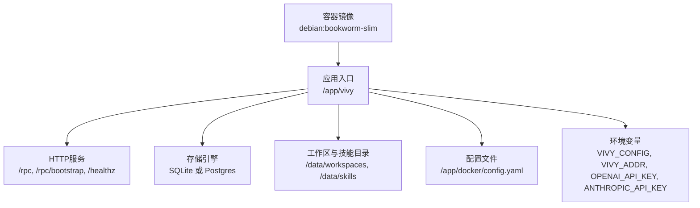
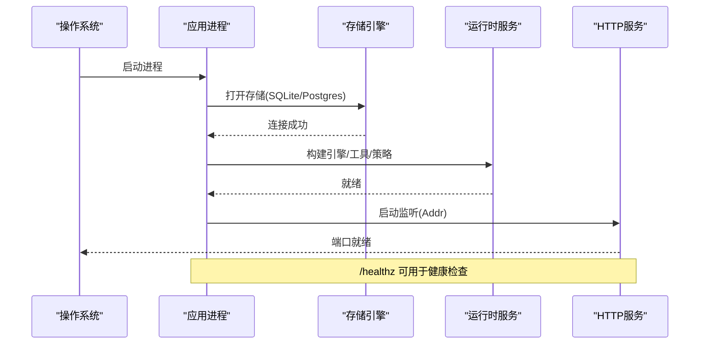
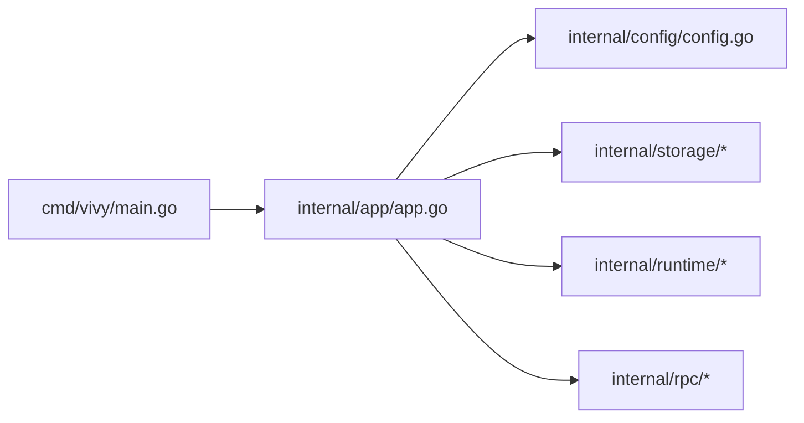

# 生产环境部署

<cite>
**本文引用的文件**
- [Dockerfile](file://Dockerfile)
- [docker-compose.yml](file://docker-compose.yml)
- [docker-compose.postgres.yml](file://docker-compose.postgres.yml)
- [docker/config.yaml](file://docker/config.yaml)
- [docker/config.postgres.yaml](file://docker/config.postgres.yaml)
- [config.example.yaml](file://config.example.yaml)
- [cmd/vivy/main.go](file://cmd/vivy/main.go)
- [internal/config/config.go](file://internal/config/config.go)
- [internal/app/app.go](file://internal/app/app.go)
- [internal/runtime/service.go](file://internal/runtime/service.go)
- [internal/storage/doc.go](file://internal/storage/doc.go)
</cite>

## 目录
1. [简介](#简介)
2. [项目结构](#项目结构)
3. [核心组件](#核心组件)
4. [架构总览](#架构总览)
5. [详细组件分析](#详细组件分析)
6. [依赖关系分析](#依赖关系分析)
7. [性能与资源限制](#性能与资源限制)
8. [高可用与容灾](#高可用与容灾)
9. [监控与日志](#监控与日志)
10. [安全与合规](#安全与合规)
11. [生产部署检查清单](#生产部署检查清单)
12. [故障排查指南](#故障排查指南)
13. [结论](#结论)

## 简介
本文件面向生产环境，提供 Vivy Agent（vivy.exe）的容器化部署指南。内容涵盖容器安全最佳实践、资源配置（CPU/内存、存储卷、日志轮转）、高可用方案（负载均衡、故障转移、备份恢复）、监控与日志收集、性能调优建议以及企业级密钥管理、网络安全与合规要求。文档严格基于仓库现有实现与配置进行说明，避免臆测。

## 项目结构
Vivy 以单进程方式运行，内嵌 UI，默认使用 SQLite 作为 Journal；可选 Postgres 作为外部持久化后端。容器镜像通过多阶段构建将前端静态资源与 Go 二进制打包，暴露 /healthz 健康检查端点，并通过 VOLUME /data 持久化数据。

图表来源
- [Dockerfile:1-48](file://Dockerfile#L1-L48)
- [docker/config.yaml:1-19](file://docker/config.yaml#L1-L19)
- [internal/app/app.go:325-362](file://internal/app/app.go#L325-L362)

章节来源
- [Dockerfile:1-48](file://Dockerfile#L1-L48)
- [docker-compose.yml:1-33](file://docker-compose.yml#L1-L33)
- [docker/config.yaml:1-19](file://docker/config.yaml#L1-L19)
- [internal/app/app.go:325-362](file://internal/app/app.go#L325-L362)

## 核心组件
- 启动与配置加载：主程序读取 VIVY_CONFIG 或 config.yaml，解析并校验配置，支持运行时覆盖监听地址（VIVY_ADDR）。
- 存储后端：默认 SQLite，可选 Postgres（DSN 来自环境变量，不在配置中明文出现）。
- 运行时与工具链：沙箱策略、网络访问控制、命令白名单、MCP 服务器等由配置驱动。
- HTTP 控制面：/rpc（WebSocket JSON-RPC）、/rpc/bootstrap（无鉴权，需同源策略保护）、/healthz（健康检查）。
- 优雅关闭：在信号处理中按逆序停止服务，确保终端事件持久化后再关闭存储。

章节来源
- [cmd/vivy/main.go:1-93](file://cmd/vivy/main.go#L1-L93)
- [internal/config/config.go:51-153](file://internal/config/config.go#L51-L153)
- [internal/app/app.go:60-120](file://internal/app/app.go#L60-L120)
- [internal/storage/doc.go:1-17](file://internal/storage/doc.go#L1-L17)

## 架构总览
Vivy 进程启动后，先打开存储引擎，再加载 Provider 包，构建模型与工具集，组装运行时服务，最后启动 HTTP 服务。所有非终态运行会在启动时尝试恢复，保证重启后的状态一致性。

图表来源
- [internal/app/app.go:84-120](file://internal/app/app.go#L84-L120)
- [internal/app/app.go:325-362](file://internal/app/app.go#L325-L362)
- [internal/storage/doc.go:1-17](file://internal/storage/doc.go#L1-L17)

## 详细组件分析

### 容器与安全基线
- 最小基础镜像：使用 debian:bookworm-slim，仅安装必要系统包（ca-certificates、tzdata、wget），减少攻击面。
- 只读文件系统：容器内应用写入集中在 /data 卷；其余路径保持只读。
- 非 root 用户：建议在编排层以非 root 用户运行容器，并限制 /data 目录权限为 0700（应用创建 data 目录时使用该权限）。
- 最小端口暴露：仅暴露 8787，且默认绑定到宿主机回环地址（127.0.0.1），避免对外暴露。
- 健康检查：容器内置 HEALTHCHECK 调用 /healthz，用于编排平台探测。

章节来源
- [Dockerfile:31-47](file://Dockerfile#L31-L47)
- [docker-compose.yml:16-29](file://docker-compose.yml#L16-L29)
- [internal/app/app.go:342-345](file://internal/app/app.go#L342-L345)

### 配置与密钥管理
- 配置文件：容器内默认使用 /app/docker/config.yaml；可通过 VIVY_CONFIG 指定外部配置路径。
- 密钥不落地：Provider 密钥通过环境变量注入（如 OPENAI_API_KEY、ANTHROPIC_API_KEY），配置中仅保存 env_key 引用，禁止硬编码。
- 存储 DSN：Postgres DSN 通过环境变量（如 VIVY_POSTGRES_DSN）注入，不在配置文件中出现。
- 监听地址覆盖：可通过 VIVY_ADDR 覆盖 server.addr，但会重新校验配置，防止绕过同源策略。

章节来源
- [cmd/vivy/main.go:76-92](file://cmd/vivy/main.go#L76-L92)
- [internal/config/config.go:85-108](file://internal/config/config.go#L85-L108)
- [internal/config/config.go:316-336](file://internal/config/config.go#L316-L336)
- [docker/config.yaml:1-19](file://docker/config.yaml#L1-L19)
- [docker/config.postgres.yaml:1-19](file://docker/config.postgres.yaml#L1-L19)

### 存储与卷规划
- 默认 SQLite：Journal 与快照存储在 /data/vivy.db；工作区与技能目录位于 /data/workspaces 与 /data/skills。
- 可选 Postgres：通过 docker-compose.postgres.yml 叠加启用，注意 replica=1，同一 DSN 多进程会导致冲突。
- 数据目录权限：应用创建 data 目录时设置 0700，建议容器以非 root 用户运行并映射只写卷。

章节来源
- [docker/config.yaml:9-18](file://docker/config.yaml#L9-L18)
- [docker/config.postgres.yaml:8-18](file://docker/config.postgres.yaml#L8-L18)
- [internal/app/app.go:77-82](file://internal/app/app.go#L77-L82)
- [docker-compose.postgres.yml:4-35](file://docker-compose.postgres.yml#L4-L35)

### 运行时策略与沙箱
- 沙箱模式：read_only、workspace_write、danger_full_access，默认 workspace_write。
- 网络访问：可配置允许域名列表与是否拒绝私有 IP。
- 命令白名单：execute_allowed_commands 限定可执行命令集合。
- 工具审批：approval 策略支持 ask/never/auto，超时自动过期。

章节来源
- [config.example.yaml:72-105](file://config.example.yaml#L72-L105)
- [internal/config/config.go:161-192](file://internal/config/config.go#L161-L192)
- [internal/config/config.go:499-527](file://internal/config/config.go#L499-L527)

### 启动流程与恢复
- 启动顺序：存储 -> Provider -> 运行时 -> HTTP。
- 重启恢复：启动前对非终态运行进行恢复，确保审批与问题交互可继续。
- 优雅关闭：按逆序停止服务，确保终端事件持久化后再关闭存储。

章节来源
- [internal/app/app.go:60-120](file://internal/app/app.go#L60-L120)
- [internal/app/app.go:316-323](file://internal/app/app.go#L316-L323)
- [internal/app/app.go:470-519](file://internal/app/app.go#L470-L519)

## 依赖关系分析
- 应用入口 cmd/vivy/main.go 负责加载配置、组装 app 并运行。
- internal/app/app.go 是组合根，负责存储、Provider、运行时、HTTP 服务的装配与生命周期管理。
- internal/config/config.go 提供类型化配置与强校验，确保密钥边界与参数合法性。
- internal/storage/doc.go 定义存储契约，SQLite 与 Postgres 均通过统一接口接入。

图表来源
- [cmd/vivy/main.go:1-93](file://cmd/vivy/main.go#L1-L93)
- [internal/app/app.go:1-120](file://internal/app/app.go#L1-L120)
- [internal/storage/doc.go:1-17](file://internal/storage/doc.go#L1-L17)

章节来源
- [cmd/vivy/main.go:1-93](file://cmd/vivy/main.go#L1-L93)
- [internal/app/app.go:1-120](file://internal/app/app.go#L1-L120)
- [internal/storage/doc.go:1-17](file://internal/storage/doc.go#L1-L17)

## 性能与资源限制
- 流式缓冲与事件负载上限：stream_buffer、max_event_payload_bytes 限制内存占用峰值。
- 上下文与历史消息：max_context_bytes、max_history_messages 控制模型输入大小。
- 工具调用预算：max_run_events、max_model_calls、max_run_tool_calls、max_run_retries 限制单次运行的资源消耗。
- HTTP 响应大小：http_max_response_bytes 限制工具返回给模型的响应大小。
- 工作区与技能目录：workspace_root、skills_root 隔离执行空间，避免污染宿主文件系统。

建议
- 根据实际负载调整 stream_buffer 与 max_event_payload_bytes，避免 OOM。
- 合理设置 max_context_bytes 与 max_history_messages，平衡上下文质量与成本。
- 在生产环境中开启沙箱网络限制与命令白名单，降低滥用风险。

章节来源
- [config.example.yaml:37-65](file://config.example.yaml#L37-L65)
- [internal/config/config.go:110-153](file://internal/config/config.go#L110-L153)
- [internal/config/config.go:384-432](file://internal/config/config.go#L384-L432)

## 高可用与容灾
- 单实例原则：官方 compose 注释明确“one Journal, one process, replica=1”，不建议 scale 多副本共享同一存储。
- 存储选择：SQLite 适合单机场景；Postgres 适合集中化存储但仍需单实例写入。
- 故障转移：由于单实例约束，故障转移需通过外部编排（如 Kubernetes StatefulSet + 迁移脚本）实现，而非简单水平扩展。
- 备份恢复：定期备份 /data 目录（含 vivy.db、workspaces、skills）；若使用 Postgres，使用 pg_dump/pg_restore 进行逻辑备份。

章节来源
- [docker-compose.yml:1-5](file://docker-compose.yml#L1-L5)
- [docker/config.postgres.yaml:1-3](file://docker/config.postgres.yaml#L1-L3)
- [internal/storage/doc.go:1-17](file://internal/storage/doc.go#L1-L17)

## 监控与日志
- 健康检查：/healthz 返回 {"status":"ok","stage":"e2-recovery"}，可用于编排平台探针。
- 日志格式：应用输出 JSON 日志到 stdout，便于外部日志采集（如 Docker 日志驱动、Kubernetes 日志收集）。
- 指标采集：当前未内置 Prometheus 指标导出，可通过外部侧车或代理采集 HTTP 请求计数与错误率。

建议
- 在编排层配置 liveness 与 readiness 探针，指向 /healthz。
- 将 stdout 日志接入集中式日志系统（如 Loki、ELK），并设置保留策略。

章节来源
- [Dockerfile:45-46](file://Dockerfile#L45-L46)
- [internal/app/app.go:342-345](file://internal/app/app.go#L342-L345)
- [cmd/vivy/main.go:36-37](file://cmd/vivy/main.go#L36-L37)

## 安全与合规
- 密钥管理：Provider 密钥通过环境变量注入，不在配置中持久化；Postgres DSN 同样通过环境变量注入。
- 网络安全：server.allowed_origins 限制跨域访问；当设置为空时，仅允许同源访问；若配置了 allowed_origins，则 server.addr 必须为回环地址。
- 沙箱策略：默认 deny_private_ips=true，限制对私有 IP 的访问；execute_allowed_commands 限定可执行命令。
- 审计与治理：支持 governance profiles 与 tool hooks，可对工具调用进行策略评估与审计。

章节来源
- [internal/config/config.go:586-609](file://internal/config/config.go#L586-L609)
- [config.example.yaml:99-105](file://config.example.yaml#L99-L105)
- [internal/config/config.go:209-231](file://internal/config/config.go#L209-L231)

## 生产部署检查清单
- 容器安全
  - 使用非 root 用户运行容器
  - 挂载只读根文件系统，仅 /data 可写
  - 仅暴露必要端口（8787），绑定到回环地址或通过反向代理暴露
- 配置与密钥
  - 使用 VIVY_CONFIG 指向外部配置
  - 通过环境变量注入 Provider 密钥与 Postgres DSN
  - 校验 server.addr 与 allowed_origins 策略
- 存储与卷
  - 确认 /data 卷已持久化并设置合适权限
  - 若使用 Postgres，确保 DSN 正确且数据库已初始化
- 监控与日志
  - 配置 /healthz 健康检查
  - 将 stdout 日志接入集中式日志系统
- 高可用与容灾
  - 遵循单实例原则，避免多副本共享同一存储
  - 制定备份计划（/data 目录或 Postgres 逻辑备份）
- 安全与合规
  - 启用沙箱网络限制与命令白名单
  - 配置 governance profiles 与 tool hooks 进行策略管控

## 故障排查指南
- 启动失败
  - 检查 VIVY_CONFIG 是否存在且有效
  - 检查 Provider 密钥环境变量是否设置
  - 检查 storage.backend 与对应配置项（sqlite.path 或 postgres.dsn_env）
- 无法访问
  - 检查 server.addr 是否正确，allowed_origins 是否匹配
  - 检查防火墙与反向代理配置
- 存储问题
  - 检查 /data 目录权限与磁盘空间
  - 若使用 Postgres，检查 DSN 与网络连接
- 健康检查失败
  - 检查 /healthz 响应内容与状态码
  - 检查应用日志中的错误信息

章节来源
- [cmd/vivy/main.go:39-54](file://cmd/vivy/main.go#L39-L54)
- [internal/config/config.go:316-336](file://internal/config/config.go#L316-L336)
- [internal/app/app.go:342-345](file://internal/app/app.go#L342-L345)

## 结论
Vivy 的生产部署应遵循单实例、最小权限、密钥不落地、只读文件系统与显式网络策略的原则。通过合理的资源配置、存储规划与监控日志体系，可在保障安全与稳定性的同时满足业务需求。对于高可用场景，需结合外部编排与备份恢复机制实现，而非简单水平扩展。