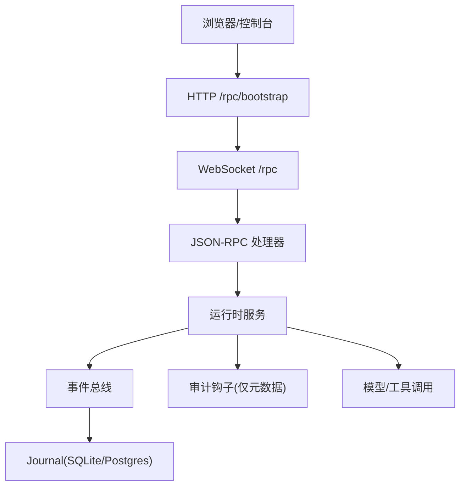
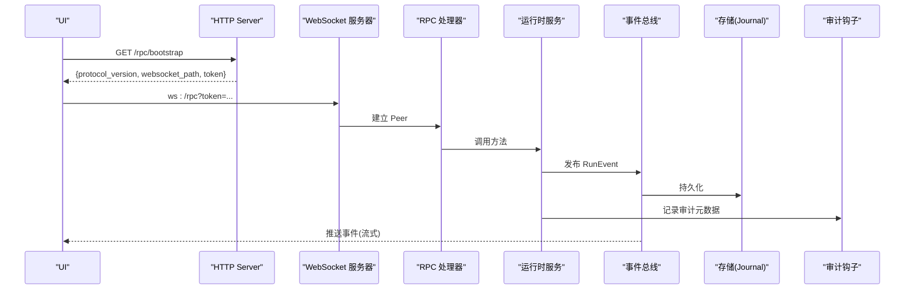
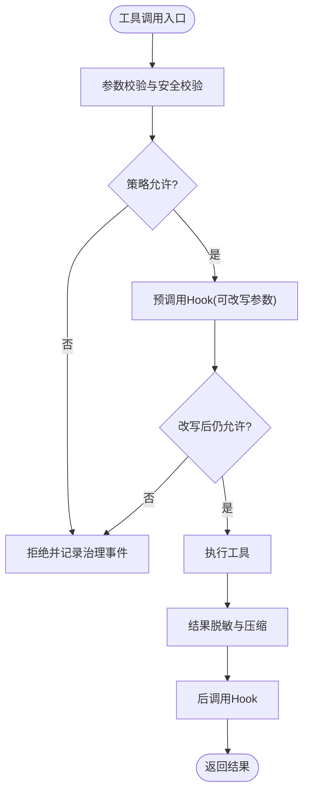
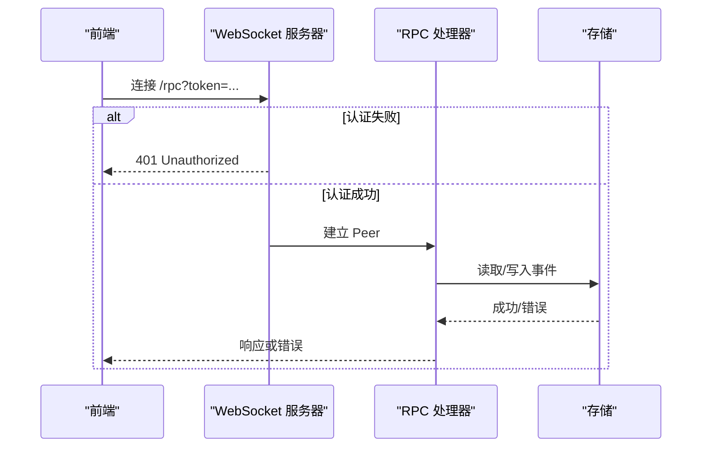
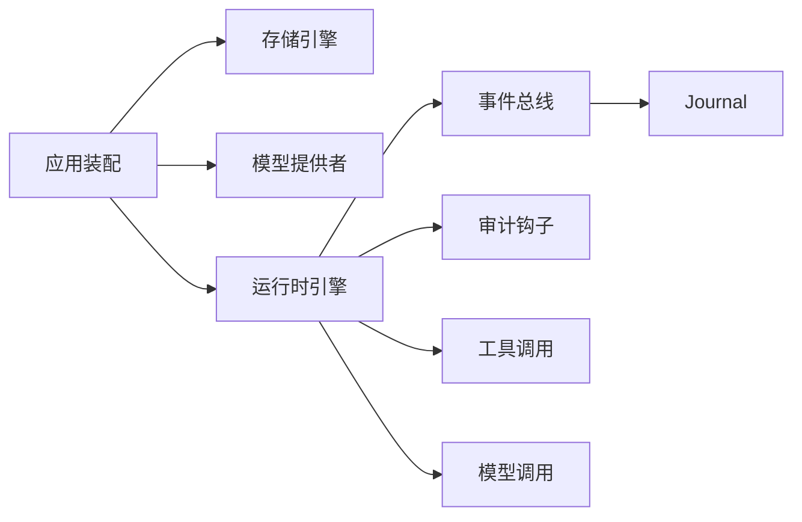

# 监控与诊断

<cite>
**本文引用的文件**
- [internal/app/app.go](file://internal/app/app.go)
- [internal/rpc/websocket.go](file://internal/rpc/websocket.go)
- [ui/src/lib/rpc.ts](file://ui/src/lib/rpc.ts)
- [internal/events/bus.go](file://internal/events/bus.go)
- [internal/runtime/audit.go](file://internal/runtime/audit.go)
- [internal/runtime/modelbroker.go](file://internal/runtime/modelbroker.go)
- [internal/runtime/toolbroker.go](file://internal/runtime/toolbroker.go)
- [internal/storage/contracts.go](file://internal/storage/contracts.go)
- [config.example.yaml](file://config.example.yaml)
- [internal/rpc/websocket_test.go](file://internal/rpc/websocket_test.go)
- [ui/src/lib/rpc.test.ts](file://ui/src/lib/rpc.test.ts)
- [internal/runtime/observability_test.go](file://internal/runtime/observability_test.go)
</cite>

## 目录
1. [简介](#简介)
2. [项目结构](#项目结构)
3. [核心组件](#核心组件)
4. [架构总览](#架构总览)
5. [详细组件分析](#详细组件分析)
6. [依赖关系分析](#依赖关系分析)
7. [性能考量](#性能考量)
8. [故障排查指南](#故障排查指南)
9. [结论](#结论)
10. [附录](#附录)

## 简介
本指南面向运维、SRE 与平台工程团队，提供 Vivy Agent（vivy.exe）的监控与诊断实践。内容覆盖：
- 健康检查端点配置与可用性观测
- 运行时指标收集：代理执行状态、工具调用统计、模型提供商性能
- 日志记录策略：审计事件、结构化日志、脱敏与聚合
- 错误追踪与调试：WebSocket 连接诊断、RPC 请求追踪、存储层监控
- 告警规则建议、日志聚合方案、性能分析工具使用
- 常见问题诊断流程与解决方案

## 项目结构
Vivy 以 Go 进程为内核，内嵌 UI，通过 HTTP + WebSocket 暴露 JSON-RPC 控制面；运行期事件经总线分发并持久化到 Journal（SQLite 或 Postgres）。关键路径：
- 启动装配：应用组装存储、提供者、运行时引擎、RPC 控制面与健康端点
- 控制面：/rpc/bootstrap 返回协议版本与 token，/rpc 升级 WebSocket 进行 RPC
- 事件总线：按 run 维度 fan-out，落盘后由订阅者消费
- 审计钩子：对每个持久化事件仅记录元数据摘要，避免泄露敏感信息

图表来源
- [internal/app/app.go:325-345](file://internal/app/app.go#L325-L345)
- [internal/rpc/websocket.go:27-47](file://internal/rpc/websocket.go#L27-L47)
- [internal/events/bus.go:46-75](file://internal/events/bus.go#L46-L75)
- [internal/runtime/audit.go:35-44](file://internal/runtime/audit.go#L35-L44)

章节来源
- [internal/app/app.go:63-362](file://internal/app/app.go#L63-L362)
- [internal/rpc/websocket.go:12-55](file://internal/rpc/websocket.go#L12-L55)
- [internal/events/bus.go:10-115](file://internal/events/bus.go#L10-L115)
- [internal/runtime/audit.go:12-62](file://internal/runtime/audit.go#L12-L62)

## 核心组件
- 健康检查与引导
  - /healthz：进程级健康探针，返回阶段信息
  - /rpc/bootstrap：返回协议版本、WebSocket 路径与一次性 token
- 控制面与鉴权
  - /rpc：基于 token 的 WebSocket 升级，支持 Origin 白名单
- 事件总线
  - 按 run 维度广播事件，慢消费者会被丢弃并由 RPC 重放
- 审计与脱敏
  - 审计钩子仅记录事件类型、序列号、负载大小与 SHA-256 摘要
- 运行时边界
  - 模型调用：预算限制、用量提取
  - 工具调用：策略评估、参数校验、结果脱敏、最大字节限制

章节来源
- [internal/app/app.go:325-345](file://internal/app/app.go#L325-L345)
- [internal/rpc/websocket.go:27-55](file://internal/rpc/websocket.go#L27-L55)
- [internal/events/bus.go:46-115](file://internal/events/bus.go#L46-L115)
- [internal/runtime/audit.go:35-62](file://internal/runtime/audit.go#L35-L62)
- [internal/runtime/modelbroker.go:84-125](file://internal/runtime/modelbroker.go#L84-L125)
- [internal/runtime/toolbroker.go:26-92](file://internal/runtime/toolbroker.go#L26-L92)

## 架构总览
下图展示从前端到后端的关键监控与诊断路径：

图表来源
- [internal/app/app.go:325-345](file://internal/app/app.go#L325-L345)
- [internal/rpc/websocket.go:27-47](file://internal/rpc/websocket.go#L27-L47)
- [internal/events/bus.go:46-75](file://internal/events/bus.go#L46-L75)
- [internal/runtime/audit.go:35-44](file://internal/runtime/audit.go#L35-L44)

## 详细组件分析

### 健康检查与可用性观测
- /healthz：用于容器编排与负载均衡的健康探测，返回进程阶段信息，便于区分启动恢复阶段与就绪状态。
- /rpc/bootstrap：返回协议版本、WebSocket 路径与 token，供 UI 建立受控通道。
- 建议指标
  - HTTP 请求计数与延迟分布（/rpc/bootstrap、/rpc）
  - WebSocket 连接数、断开原因、重连次数
  - 启动耗时、恢复耗时

章节来源
- [internal/app/app.go:325-345](file://internal/app/app.go#L325-L345)

### 运行时监控：代理执行状态、工具调用、模型提供商
- 代理执行状态
  - 事件总线按 run 维度广播，终端事件关闭流；可通过订阅计数观察活跃订阅者数量
- 工具调用统计
  - 每次工具调用经过策略评估、参数校验、Hook 重写再评估、结果脱敏与压缩；可统计调用次数、拒绝率、平均耗时、结果大小
- 模型提供商性能
  - 模型调用走预算预留与用量提取；可统计调用次数、令牌用量、推理令牌、停止原因、重试与卡顿事件

图表来源
- [internal/runtime/toolbroker.go:26-92](file://internal/runtime/toolbroker.go#L26-L92)

章节来源
- [internal/events/bus.go:46-115](file://internal/events/bus.go#L46-L115)
- [internal/runtime/toolbroker.go:26-92](file://internal/runtime/toolbroker.go#L26-L92)
- [internal/runtime/modelbroker.go:84-125](file://internal/runtime/modelbroker.go#L84-L125)

### 日志记录策略与审计
- 审计钩子：对每个持久化事件仅记录 RunID、Seq、Type、CreatedAt、PayloadBytes、PayloadSHA256，不记录原始负载，避免泄露密钥与敏感参数
- 结构化日志：使用标准日志库输出审计事件，便于集中采集
- 建议
  - 将审计事件与业务日志分离，设置不同保留策略
  - 在日志中统一包含 run_id、seq、tool_name、model_provider 等关联键

章节来源
- [internal/runtime/audit.go:12-62](file://internal/runtime/audit.go#L12-L62)

### 错误追踪与调试：WebSocket、RPC、存储层
- WebSocket 连接诊断
  - 必须携带 token，支持 Origin 白名单；连接失败常见原因：token 缺失/错误、Origin 被拒、网络不可达
  - 前端错误码 -32098 表示控制平面断开，可用于重连与告警
- RPC 请求追踪
  - 通过 jsonrpc id 关联请求与响应；可在服务端记录 method、id、耗时、错误码
- 存储层监控
  - 关注 Journal Append/Replay 错误、Lease 获取/丢失、Run 已终止追加失败等异常

图表来源
- [internal/rpc/websocket.go:27-55](file://internal/rpc/websocket.go#L27-L55)
- [internal/storage/contracts.go:11-31](file://internal/storage/contracts.go#L11-L31)

章节来源
- [internal/rpc/websocket.go:27-55](file://internal/rpc/websocket.go#L27-L55)
- [ui/src/lib/rpc.ts:38-154](file://ui/src/lib/rpc.ts#L38-L154)
- [internal/storage/contracts.go:11-31](file://internal/storage/contracts.go#L11-L31)

### 告警规则建议
- 可用性
  - /healthz 连续失败 N 次
  - WebSocket 连接成功率低于阈值
- 性能
  - /rpc/bootstrap 与 /rpc 请求 P95/P99 延迟突增
  - 模型调用超时、重试率升高、卡顿事件增多
- 可靠性
  - 事件总线订阅者频繁掉队（需重放）
  - 存储层 Lease 丢失、Append 失败、Run 已终止追加失败
- 安全
  - 大量未授权访问尝试（token 错误或 Origin 被拒）
  - 审计事件中 payload_sha256 异常增长（可能负载膨胀）

[本节为通用建议，无需代码引用]

### 日志聚合方案
- 采集
  - 收集进程 stdout/stderr 与审计事件日志
  - 按 run_id、seq、type 等字段索引
- 存储与查询
  - 使用日志系统（如 Elasticsearch/Loki）按时间分片，保留策略与成本权衡
- 可视化
  - 仪表盘：健康、延迟、错误率、订阅者数量、工具调用量、模型用量
  - 链路：以 run_id 串联事件，定位问题根因

[本节为通用建议，无需代码引用]

### 性能分析工具使用
- 进程级
  - CPU/内存采样，识别热点函数（如事件广播、序列化、存储 IO）
- 网络
  - WebSocket 握手与消息往返时延、重传与拥塞
- 存储
  - SQLite WAL 模式下的写入吞吐与锁竞争；Postgres 连接池与慢查询
- 运行时
  - 预算耗尽、最大事件/调用限制触发频率

[本节为通用建议，无需代码引用]

## 依赖关系分析
- 应用装配依赖
  - 存储引擎（SQLite/Postgres）、提供者（OpenAI/Anthropic/Mock）、运行时引擎、RPC 控制面、审计钩子
- 运行时边界
  - 模型调用通过预算与用量提取；工具调用通过策略与 Hook 链保护
- 事件与持久化
  - 事件总线负责实时分发，Journal 作为唯一事实源，RPC 通过重放保证一致性

图表来源
- [internal/app/app.go:63-362](file://internal/app/app.go#L63-L362)
- [internal/events/bus.go:46-115](file://internal/events/bus.go#L46-L115)
- [internal/runtime/audit.go:35-44](file://internal/runtime/audit.go#L35-L44)

章节来源
- [internal/app/app.go:63-362](file://internal/app/app.go#L63-L362)
- [internal/storage/contracts.go:252-273](file://internal/storage/contracts.go#L252-L273)

## 性能考量
- 事件总线缓冲
  - 缓冲区过小会导致订阅者掉队；过大则增加内存占用。建议根据峰值订阅速率调整
- 模型调用预算
  - 合理设置最大调用次数与重试次数，避免雪崩
- 工具结果大小
  - 限制最大结果字节，防止大对象阻塞管道
- 存储 IO
  - SQLite 适合单机轻量场景；高并发写入考虑 Postgres 与连接池调优
- 网络
  - WebSocket 读写缓冲适中，避免背压导致丢消息

[本节为通用建议，无需代码引用]

## 故障排查指南
- WebSocket 无法连接
  - 检查 token 是否正确传递、Origin 是否在白名单、网络可达性
  - 参考测试用例验证握手与鉴权流程
- RPC 请求无响应
  - 检查 jsonrpc id 是否匹配、服务端是否抛出错误、事件总线是否满导致订阅者被丢弃
- 模型调用失败
  - 检查预算是否耗尽、重试次数、卡顿事件、用量上报是否正常
- 工具调用被拒绝
  - 检查策略评估结果、Hook 改写后的再评估、参数安全校验
- 存储层异常
  - 关注 Lease 丢失、Run 已终止追加失败、版本冲突等错误

章节来源
- [internal/rpc/websocket_test.go:15-85](file://internal/rpc/websocket_test.go#L15-L85)
- [ui/src/lib/rpc.test.ts:4-11](file://ui/src/lib/rpc.test.ts#L4-L11)
- [internal/runtime/observability_test.go:12-73](file://internal/runtime/observability_test.go#L12-L73)
- [internal/storage/contracts.go:11-31](file://internal/storage/contracts.go#L11-L31)

## 结论
Vivy 的监控与诊断围绕“事件即事实”的设计展开：通过健康探针、控制面鉴权、事件总线与审计钩子，形成从接入到落盘的完整观测闭环。结合合理的告警规则、日志聚合与性能分析工具，可有效保障系统的稳定性与可维护性。

## 附录

### 配置要点（节选）
- server.addr：监听地址
- storage.backend：sqlite/postgres
- providers.active：openai/anthropic/mock
- runtime.stream_buffer、max_event_payload_bytes、max_model_calls、max_run_tool_calls 等运行时限制
- tools.approval.expiration：审批过期时间

章节来源
- [config.example.yaml:5-136](file://config.example.yaml#L5-L136)