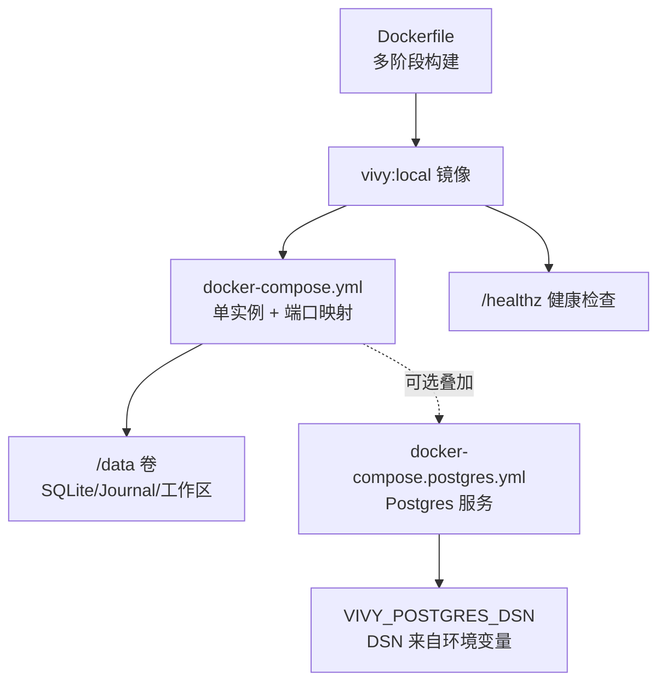
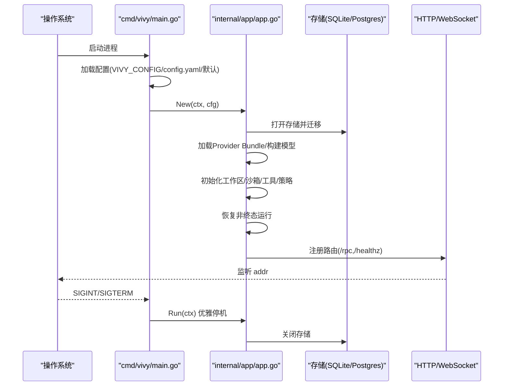
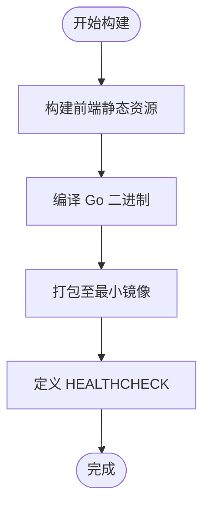
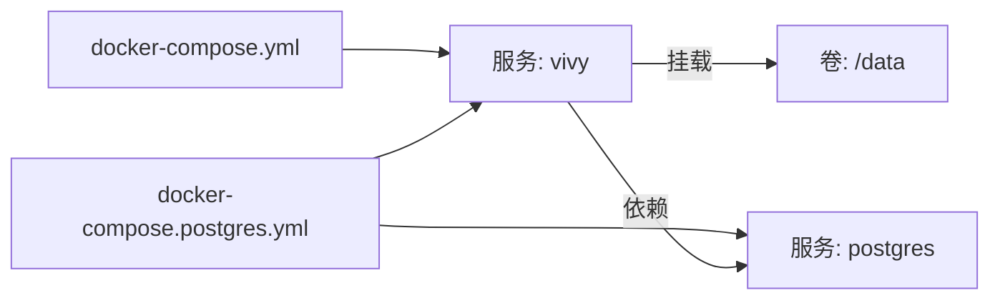
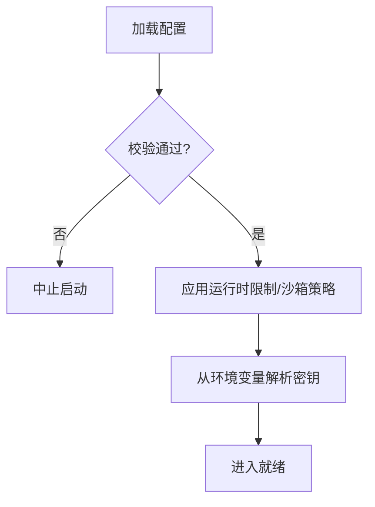
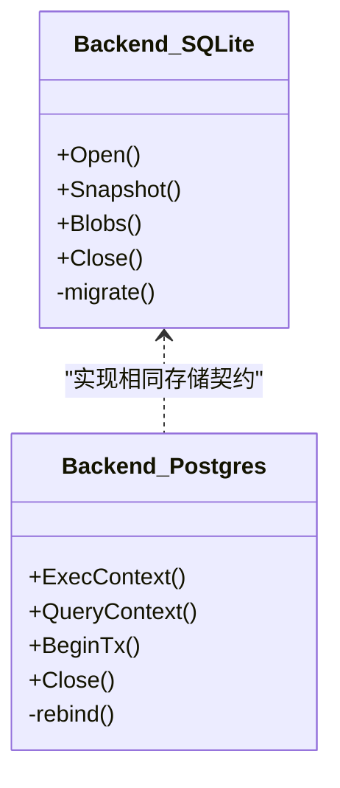
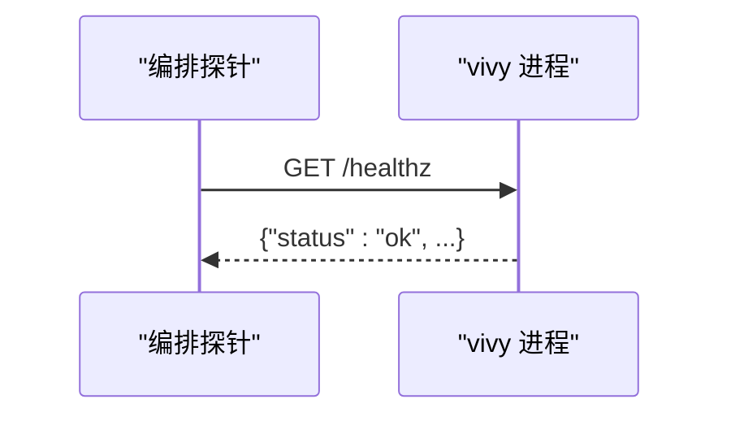
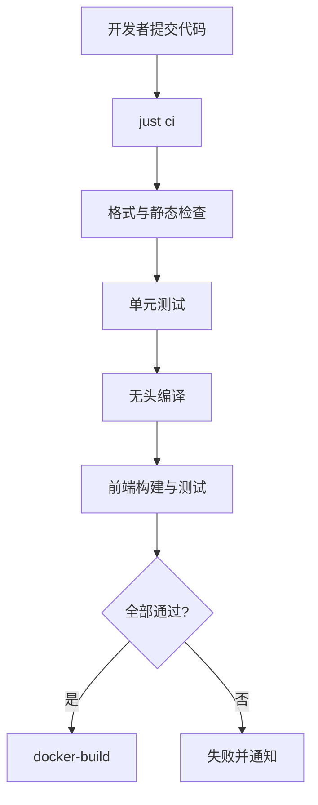
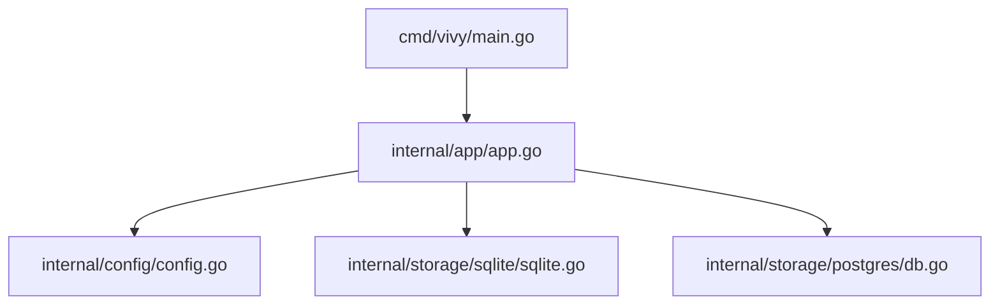

# 部署与运维

<cite>
**本文引用的文件**
- [Dockerfile](file://Dockerfile)
- [docker-compose.yml](file://docker-compose.yml)
- [docker-compose.postgres.yml](file://docker-compose.postgres.yml)
- [config.example.yaml](file://config.example.yaml)
- [docker/config.yaml](file://docker/config.yaml)
- [docker/config.postgres.yaml](file://docker/config.postgres.yaml)
- [justfile](file://justfile)
- [cmd/vivy/main.go](file://cmd/vivy/main.go)
- [internal/config/config.go](file://internal/config/config.go)
- [internal/app/app.go](file://internal/app/app.go)
- [internal/storage/sqlite/sqlite.go](file://internal/storage/sqlite/sqlite.go)
- [internal/storage/postgres/db.go](file://internal/storage/postgres/db.go)
</cite>

## 目录
1. [简介](#简介)
2. [项目结构](#项目结构)
3. [核心组件](#核心组件)
4. [架构总览](#架构总览)
5. [详细组件分析](#详细组件分析)
6. [依赖关系分析](#依赖关系分析)
7. [性能考量](#性能考量)
8. [故障排查指南](#故障排查指南)
9. [结论](#结论)
10. [附录](#附录)

## 简介
本文件面向生产环境的容器化部署与运维，覆盖镜像构建、编排配置、环境管理、负载均衡与健康检查、日志收集、监控告警、备份恢复、数据迁移、版本升级、CI/CD流水线、自动化测试与质量门禁、容量规划等主题。Vivy 以单进程方式运行（replica=1），内嵌 UI，默认使用 SQLite 作为 Journal；可选 Postgres 作为外部存储后端。所有密钥通过环境变量注入，不持久化到配置或日志中。

## 项目结构
- 容器镜像：基于多阶段构建，先构建前端静态资源，再编译 Go 二进制并打包进最小运行时镜像。
- 编排：提供基础 compose 与可选的 Postgres 叠加 compose，统一挂载 /data 卷用于持久化。
- 配置：支持 config.yaml 与环境变量覆盖；容器镜像内置 docker/config.yaml 覆盖默认值。
- 入口：cmd/vivy 负责加载配置、组装应用、启动 HTTP/WebSocket 服务并处理优雅停机。
- 存储：SQLite 为默认单写引擎；Postgres 通过 DSN 环境变量注入，禁止在配置中明文出现。

**图示来源**
- [Dockerfile:1-48](file://Dockerfile#L1-L48)
- [docker-compose.yml:1-33](file://docker-compose.yml#L1-L33)
- [docker-compose.postgres.yml:1-35](file://docker-compose.postgres.yml#L1-L35)

**章节来源**
- [Dockerfile:1-48](file://Dockerfile#L1-L48)
- [docker-compose.yml:1-33](file://docker-compose.yml#L1-L33)
- [docker-compose.postgres.yml:1-35](file://docker-compose.postgres.yml#L1-L35)

## 核心组件
- 应用装配与生命周期：internal/app 负责按顺序初始化存储、Provider、运行时、控制面 RPC、UI，并在启动前完成非终态运行的恢复；关闭时按逆序释放资源，保证事件落盘。
- 配置与校验：internal/config 提供强类型配置与严格校验，确保地址、存储后端、Provider 选择、工具启用列表、沙箱策略等均合法；密钥仅通过 env_key 引用环境变量。
- 存储抽象：sqlite 与 postgres 实现统一的存储契约；SQLite 单写、WAL 模式；Postgres 通过 DSN 注入且具备租约保护。
- 健康检查：/healthz 返回就绪状态，供 Docker/K8s 探针使用。

**章节来源**
- [internal/app/app.go:1-120](file://internal/app/app.go#L1-L120)
- [internal/app/app.go:316-362](file://internal/app/app.go#L316-L362)
- [internal/app/app.go:470-520](file://internal/app/app.go#L470-L520)
- [internal/config/config.go:51-110](file://internal/config/config.go#L51-L110)
- [internal/config/config.go:316-336](file://internal/config/config.go#L316-L336)
- [internal/config/config.go:338-528](file://internal/config/config.go#L338-L528)
- [internal/storage/sqlite/sqlite.go:17-55](file://internal/storage/sqlite/sqlite.go#L17-L55)
- [internal/storage/postgres/db.go:13-58](file://internal/storage/postgres/db.go#L13-L58)

## 架构总览
Vivy 进程启动流程：
- 读取配置（优先 VIVY_CONFIG，其次 config.yaml，否则内置默认）
- 创建数据目录与存储后端（SQLite 或 Postgres）
- 加载 Provider Bundle，构建模型
- 初始化工作区隔离、沙箱、工具集、策略与审计钩子
- 启动事件总线与服务，恢复非终态运行
- 注册 /rpc、/rpc/bootstrap、/healthz 路由，启动 HTTP 服务
- 监听信号，执行有界宽限期的优雅停机

**图示来源**
- [cmd/vivy/main.go:23-74](file://cmd/vivy/main.go#L23-L74)
- [internal/app/app.go:63-120](file://internal/app/app.go#L63-L120)
- [internal/app/app.go:316-362](file://internal/app/app.go#L316-L362)
- [internal/app/app.go:470-520](file://internal/app/app.go#L470-L520)

## 详细组件分析

### 容器镜像与构建
- 多阶段构建：Node 阶段构建前端静态资源；Go 阶段编译二进制；最终镜像仅包含可执行文件与必要运行时依赖。
- 构建参数：GOPROXY、NPM_REGISTRY 用于加速依赖下载。
- 暴露端口：8787；健康检查通过 wget 访问 /healthz。
- 数据持久化：/data 卷承载 SQLite 数据库、工作区与技能包。

**图示来源**
- [Dockerfile:7-29](file://Dockerfile#L7-L29)
- [Dockerfile:31-48](file://Dockerfile#L31-L48)

**章节来源**
- [Dockerfile:1-48](file://Dockerfile#L1-L48)

### 编排与环境管理
- 基础编排：单实例 vivy，端口映射到 127.0.0.1:8787，避免对外暴露无鉴权接口。
- 数据卷：vivy-data 持久化 /data。
- 环境变量：TZ、OPENAI_API_KEY、ANTHROPIC_API_KEY。
- 可选叠加：docker-compose.postgres.yml 引入 Postgres 服务，并通过 VIVY_POSTGRES_DSN 注入 DSN。

**图示来源**
- [docker-compose.yml:1-33](file://docker-compose.yml#L1-L33)
- [docker-compose.postgres.yml:1-35](file://docker-compose.postgres.yml#L1-L35)

**章节来源**
- [docker-compose.yml:1-33](file://docker-compose.yml#L1-L33)
- [docker-compose.postgres.yml:1-35](file://docker-compose.postgres.yml#L1-L35)

### 配置体系与安全边界
- 配置优先级：VIVY_CONFIG > config.yaml > 内置默认。
- 安全规则：密钥仅通过 env_key 引用环境变量，不在配置文件中出现；日志与快照需脱敏。
- 存储后端：sqlite（默认）或 postgres（DSN 来自环境变量）。
- 运行时限制：流缓冲、事件负载大小、上下文大小、历史消息数、工具调用次数、重试次数等均有上限。
- 沙箱策略：默认 workspace_write，支持 read_only/danger_full_access；网络访问白名单与私有 IP 拦截。

**图示来源**
- [cmd/vivy/main.go:76-92](file://cmd/vivy/main.go#L76-L92)
- [internal/config/config.go:316-336](file://internal/config/config.go#L316-L336)
- [internal/config/config.go:338-528](file://internal/config/config.go#L338-L528)

**章节来源**
- [config.example.yaml:1-136](file://config.example.yaml#L1-L136)
- [docker/config.yaml:1-19](file://docker/config.yaml#L1-L19)
- [docker/config.postgres.yaml:1-19](file://docker/config.postgres.yaml#L1-L19)
- [internal/config/config.go:51-110](file://internal/config/config.go#L51-L110)
- [internal/config/config.go:316-528](file://internal/config/config.go#L316-L528)

### 存储与数据迁移
- SQLite：单写连接池，自动迁移 schema_migrations；提供快照与 Blob 存储能力。
- Postgres：通过 DSN 注入，查询占位符重写为 $n；具备租约保护防止多副本写入冲突。
- 迁移：每次启动按序应用未执行的迁移，失败则中止启动，保证一致性。

**图示来源**
- [internal/storage/sqlite/sqlite.go:17-55](file://internal/storage/sqlite/sqlite.go#L17-L55)
- [internal/storage/sqlite/sqlite.go:109-147](file://internal/storage/sqlite/sqlite.go#L109-L147)
- [internal/storage/postgres/db.go:13-58](file://internal/storage/postgres/db.go#L13-L58)
- [internal/storage/postgres/db.go:93-107](file://internal/storage/postgres/db.go#L93-L107)

**章节来源**
- [internal/storage/sqlite/sqlite.go:17-55](file://internal/storage/sqlite/sqlite.go#L17-L55)
- [internal/storage/sqlite/sqlite.go:109-147](file://internal/storage/sqlite/sqlite.go#L109-L147)
- [internal/storage/postgres/db.go:13-58](file://internal/storage/postgres/db.go#L13-L58)

### 健康检查与可用性
- /healthz 返回 JSON 状态，用于容器健康检查与编排层探针。
- 健康检查命令：wget 访问本地 8787 端口，超时与重试参数合理设置。

**图示来源**
- [internal/app/app.go:342-345](file://internal/app/app.go#L342-L345)
- [Dockerfile:45-46](file://Dockerfile#L45-L46)
- [docker-compose.yml:24-29](file://docker-compose.yml#L24-L29)

**章节来源**
- [internal/app/app.go:342-345](file://internal/app/app.go#L342-L345)
- [Dockerfile:45-46](file://Dockerfile#L45-L46)
- [docker-compose.yml:24-29](file://docker-compose.yml#L24-L29)

### 日志与审计
- 标准输出 JSON 日志：便于集中采集与结构化分析。
- 审计钩子：将关键操作记录到审计 sink，支持后续追溯。
- 建议：在生产环境中将 stdout 接入日志系统（如 journald、Fluent Bit、Vector、ELK/Opensearch）。

**章节来源**
- [cmd/vivy/main.go:36-37](file://cmd/vivy/main.go#L36-L37)
- [internal/app/app.go:219-254](file://internal/app/app.go#L219-L254)

### 备份与恢复
- SQLite：直接复制 /data/vivy.db 文件进行备份；建议在低峰期进行，或使用 WAL 模式下的热备工具。
- Postgres：使用 pg_dump/pg_restore 或云厂商提供的备份方案；DSN 通过环境变量注入，不落地配置。
- 恢复：停止服务后替换数据文件或导入备份，重启服务即可。

**章节来源**
- [docker/config.yaml:9-12](file://docker/config.yaml#L9-L12)
- [docker/config.postgres.yaml:8-12](file://docker/config.postgres.yaml#L8-L12)
- [internal/storage/sqlite/sqlite.go:17-55](file://internal/storage/sqlite/sqlite.go#L17-L55)
- [internal/storage/postgres/db.go:13-58](file://internal/storage/postgres/db.go#L13-L58)

### 数据迁移与版本升级
- 存储迁移：SQLite 启动时按序应用迁移脚本，失败即中止启动，确保版本一致。
- 版本升级：滚动更新镜像；由于 replica=1，升级期间短暂不可用；可通过蓝绿或金丝雀发布降低风险。
- 兼容性：升级前确认存储迁移已就绪；必要时先对数据进行快照备份。

**章节来源**
- [internal/storage/sqlite/sqlite.go:109-147](file://internal/storage/sqlite/sqlite.go#L109-L147)
- [internal/app/app.go:470-520](file://internal/app/app.go#L470-L520)

### CI/CD 流水线与质量门禁
- 本地任务：justfile 提供 build、test、vet、fmt-check、ui-ci、ci、docker-build、docker-up 等快捷命令。
- 质量门禁：ci 组合了格式检查、静态检查、单元测试、无头编译与前端构建；建议集成到 Git 平台的 CI 中。
- 容器构建：docker-build 使用固定代理与镜像源，确保可重复构建。

**图示来源**
- [justfile:23-37](file://justfile#L23-L37)
- [justfile:49-57](file://justfile#L49-L57)

**章节来源**
- [justfile:1-70](file://justfile#L1-L70)

### 监控与诊断
- 指标：当前未暴露 Prometheus 指标端点；可通过日志分析与审计钩子获取关键事件。
- 诊断：利用 /healthz 探针判断服务状态；结合日志系统与审计记录定位问题。
- 建议：在编排层增加资源限制与探针；将日志接入集中式平台；对关键路径添加业务指标埋点。

**章节来源**
- [internal/app/app.go:342-345](file://internal/app/app.go#L342-L345)
- [internal/app/app.go:219-254](file://internal/app/app.go#L219-L254)

### 容量规划建议
- CPU/内存：根据并发会话与模型调用频率评估；默认限制已防止资源滥用（事件、调用次数、上下文大小）。
- 存储：SQLite 适合单机小中型场景；高并发或大规模数据建议使用 Postgres。
- I/O：WAL 模式与单写连接减少锁竞争；注意磁盘吞吐与延迟。

**章节来源**
- [internal/config/config.go:110-153](file://internal/config/config.go#L110-L153)
- [internal/storage/sqlite/sqlite.go:45-47](file://internal/storage/sqlite/sqlite.go#L45-L47)

## 依赖关系分析
- cmd/vivy 依赖 internal/app 与 internal/config。
- internal/app 依赖 storage、provider、runtime、rpc、studio、tools 等模块。
- storage 抽象由 sqlite 与 postgres 实现，遵循统一契约。
- 配置校验贯穿整个启动链路，任何非法配置都会中止启动。

**图示来源**
- [cmd/vivy/main.go:6-17](file://cmd/vivy/main.go#L6-L17)
- [internal/app/app.go:13-39](file://internal/app/app.go#L13-L39)
- [internal/storage/sqlite/sqlite.go:1-15](file://internal/storage/sqlite/sqlite.go#L1-L15)
- [internal/storage/postgres/db.go:1-11](file://internal/storage/postgres/db.go#L1-L11)

**章节来源**
- [cmd/vivy/main.go:6-17](file://cmd/vivy/main.go#L6-L17)
- [internal/app/app.go:13-39](file://internal/app/app.go#L13-L39)

## 性能考量
- 流式缓冲与事件负载限制：防止内存膨胀与长尾请求。
- 上下文与历史消息上限：控制模型输入规模，降低延迟与成本。
- 工具调用与重试上限：避免无限循环与资源耗尽。
- 存储后端选择：SQLite 单写适合轻量场景；Postgres 适合高并发与分布式需求。

**章节来源**
- [internal/config/config.go:110-153](file://internal/config/config.go#L110-L153)
- [internal/config/config.go:384-423](file://internal/config/config.go#L384-L423)

## 故障排查指南
- 启动失败：检查配置是否合法（server.addr、storage.backend、providers.active、tools.enabled 等）；查看日志中的错误信息。
- 存储问题：SQLite 路径是否存在并可写；Postgres DSN 是否正确且可达。
- 健康检查失败：确认 /healthz 可访问；检查端口绑定与防火墙。
- 优雅停机：关注关闭阶段的超时与资源释放；确保事件落盘完成。

**章节来源**
- [internal/config/config.go:338-528](file://internal/config/config.go#L338-L528)
- [internal/app/app.go:470-520](file://internal/app/app.go#L470-L520)

## 结论
Vivy 采用单进程、单 Journal 的设计，配合严格的配置校验与安全边界，提供了稳定可靠的 Agent 运行时。通过容器化与编排，可实现一键部署与可扩展的存储后端。生产环境应重点关注健康检查、日志采集、备份恢复与容量规划，并结合 CI/CD 实现自动化测试与质量门禁。

## 附录
- 常用命令：
  - 构建镜像：just docker-build
  - 启动服务：just docker-up
  - 使用 Postgres：just docker-up-postgres
  - 运行测试：just test
  - 前端构建与测试：just ui-ci
- 环境变量：
  - VIVY_CONFIG：配置文件路径
  - VIVY_ADDR：监听地址（覆盖 server.addr）
  - VIVY_POSTGRES_DSN：Postgres DSN
  - OPENAI_API_KEY、ANTHROPIC_API_KEY：Provider 密钥

**章节来源**
- [justfile:42-57](file://justfile#L42-L57)
- [docker-compose.postgres.yml:22-31](file://docker-compose.postgres.yml#L22-L31)
- [internal/config/config.go:85-89](file://internal/config/config.go#L85-L89)