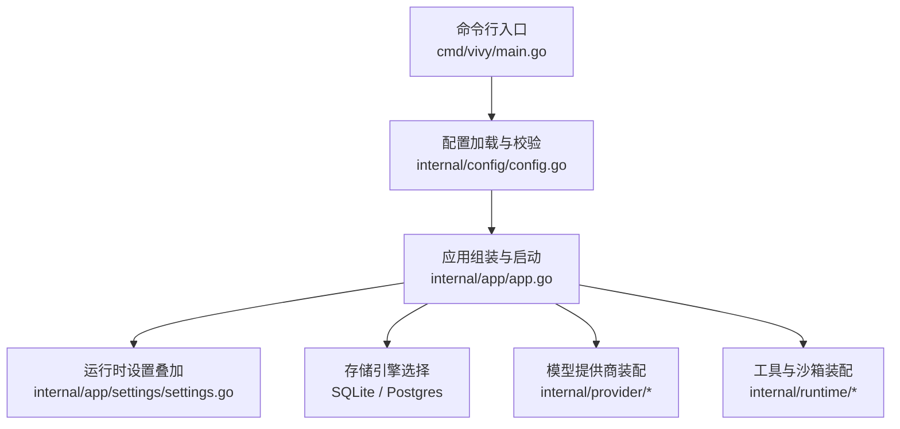
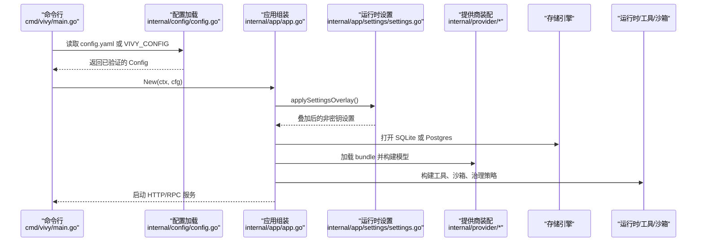
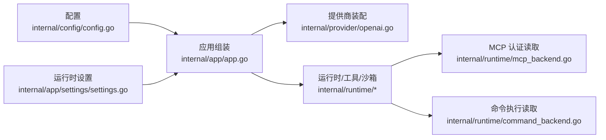

# 配置管理

<cite>
**本文引用的文件**
- [internal/config/config.go](file://internal/config/config.go)
- [config.example.yaml](file://config.example.yaml)
- [config.dev.yaml](file://config.dev.yaml)
- [docker/config.yaml](file://docker/config.yaml)
- [docker/config.postgres.yaml](file://docker/config.postgres.yaml)
- [cmd/vivy/main.go](file://cmd/vivy/main.go)
- [internal/app/app.go](file://internal/app/app.go)
- [internal/app/settings/settings.go](file://internal/app/settings/settings.go)
- [internal/provider/openai.go](file://internal/provider/openai.go)
- [internal/runtime/mcp_backend.go](file://internal/runtime/mcp_backend.go)
- [internal/runtime/command_backend.go](file://internal/runtime/command_backend.go)
</cite>

## 目录
1. [简介](#简介)
2. [项目结构](#项目结构)
3. [核心组件](#核心组件)
4. [架构总览](#架构总览)
5. [详细组件分析](#详细组件分析)
6. [依赖关系分析](#依赖关系分析)
7. [性能考虑](#性能考虑)
8. [故障排查指南](#故障排查指南)
9. [结论](#结论)
10. [附录：配置项参考与示例](#附录配置项参考与示例)

## 简介
本文件系统性说明 Vivy Agent（vivy.exe）的配置管理机制，覆盖配置结构定义、环境变量映射、默认值管理、配置文件格式与校验规则、运行时更新与回滚策略、安全与密钥管理、多环境配置、最佳实践、故障排查与性能调优，并提供不同部署场景的配置示例。

## 项目结构
Vivy 的配置由“启动时加载的强类型 YAML 配置”和“独立于生产配置的运行时设置”两部分组成：
- 启动配置：位于 config.yaml（或 VIVY_CONFIG 指定路径），在进程启动时读取并严格校验，决定服务监听地址、存储后端、模型提供商、运行期限制、工具启用列表、治理策略等。
- 运行时设置：位于 data/agent-home/settings.yaml，用于操作员选择活跃提供商、默认模型与可选 BaseURL；该文件不保存密钥，重启后生效。

图表来源
- [cmd/vivy/main.go:1-93](file://cmd/vivy/main.go#L1-L93)
- [internal/config/config.go:1-642](file://internal/config/config.go#L1-L642)
- [internal/app/app.go:1-520](file://internal/app/app.go#L1-L520)
- [internal/app/settings/settings.go:1-133](file://internal/app/settings/settings.go#L1-L133)

章节来源
- [cmd/vivy/main.go:1-93](file://cmd/vivy/main.go#L1-L93)
- [internal/config/config.go:1-642](file://internal/config/config.go#L1-L642)
- [internal/app/app.go:1-520](file://internal/app/app.go#L1-L520)
- [internal/app/settings/settings.go:1-133](file://internal/app/settings/settings.go#L1-L133)

## 核心组件
- 配置结构与默认值：Config 结构体定义了 server、storage、providers、runtime、tools、governance 六大模块，并提供 Default() 内置默认值。
- 配置加载与校验：Load() 使用严格解码（拒绝未知字段），Validate() 对每个关键字段进行范围与合法性检查，非法则中止启动。
- 环境变量映射：所有敏感信息（如 API Key、Postgres DSN、MCP 认证）仅以环境变量名引用，不在配置中持久化。
- 运行时设置叠加：settings.yaml 可覆盖活跃提供商、默认模型与 BaseURL，但不改变生产配置与 Journal。
- 数据目录计算：DataDirectory() 根据后端与 SQLite 路径推导 settings、evals 等非 Journal 数据的根目录。

章节来源
- [internal/config/config.go:51-314](file://internal/config/config.go#L51-L314)
- [internal/config/config.go:316-528](file://internal/config/config.go#L316-L528)
- [internal/config/config.go:530-545](file://internal/config/config.go#L530-L545)
- [internal/app/settings/settings.go:43-107](file://internal/app/settings/settings.go#L43-L107)

## 架构总览
配置从命令行入口进入，经严格解析与校验后注入到应用装配阶段，驱动存储、提供商、工具链、沙箱与治理策略的构建。

图表来源
- [cmd/vivy/main.go:23-92](file://cmd/vivy/main.go#L23-L92)
- [internal/app/app.go:63-363](file://internal/app/app.go#L63-L363)
- [internal/app/settings/settings.go:393-425](file://internal/app/settings/settings.go#L393-L425)

## 详细组件分析

### 配置结构与默认值
- Server：监听地址与允许的浏览器源（跨域）。默认监听 127.0.0.1:8787，空 origins 表示同源访问。
- Storage：后端 sqlite/postgres，data_dir 控制非 Journal 数据根；sqlite.path 必须非空；postgres.dsn_env 必须为合法环境变量名。
- Providers：active 选择 openai 或 anthropic；bundle_dir 指向预置 bundle；每个 provider 通过 env_key 引用密钥，default_model 指定默认模型。
- Runtime：流缓冲、事件负载上限、上下文与历史消息上限、工具调用与重试预算、工作区与技能根、HTTP 白名单与响应大小、MCP 服务器、可执行命令白名单、沙箱策略。
- Tools：启用的工具列表与审批过期时间。
- Governance：治理策略 profile、hook_timeout、profiles 规则集。

默认值来源于 Default()，确保无配置文件时仍可安全启动。

章节来源
- [internal/config/config.go:51-153](file://internal/config/config.go#L51-L153)
- [internal/config/config.go:254-314](file://internal/config/config.go#L254-L314)

### 环境变量映射与密钥边界
- 密钥永不写入配置：provider.env_key、postgres.dsn_env、mcp_servers[].auth_env 均只允许环境变量名，并在请求时读取。
- 启动时强制校验：若 postgres.dsn_env 未设置或非法，将中止启动。
- BaseURL 覆盖：settings.base_url 通过设置 VIVY_API_BASE 环境变量影响 OpenAI 兼容网关。

章节来源
- [internal/config/config.go:85-108](file://internal/config/config.go#L85-L108)
- [internal/config/config.go:350-382](file://internal/config/config.go#L350-L382)
- [internal/app/app.go:418-425](file://internal/app/app.go#L418-L425)
- [internal/provider/openai.go:36-65](file://internal/provider/openai.go#L36-L65)

### 配置文件格式与校验规则
- 严格解码：未知字段直接报错，防止密钥泄漏。
- 字段校验：
  - server.addr 必须为有效 host:port；当 allowed_origins 非空时，addr 主机必须为环回地址。
  - storage.backend 仅支持 sqlite/postgres；sqlite.path 非空；postgres.dsn_env 必须匹配环境变量命名规范。
  - providers.active 仅 openai/anthropic；bundle_dir 非空；各 provider 的 env_key 与 default_model 校验。
  - runtime.* 多项数值需为正数或非负；mock_scenario 仅在 mock=true 时可用且取值受限；workspace_root/skills_root 非空；http_max_response_bytes 正数；mcp_servers.endpoint 为绝对 HTTP(S) URL。
  - tools.enabled 至少一项；tools.approval.expiration 必须为正时长。
  - governance.profile 必须为内置 profile；hook_timeout 必须为正时长；rules 字段与决策值受控。
  - sandbox.default_mode 限定三种模式；sandbox.workspace_root 若设置需校验路径；approval.timeout_seconds 非负。

章节来源
- [internal/config/config.go:316-528](file://internal/config/config.go#L316-L528)

### 热重载机制与运行时更新
- 当前进程配置：启动时一次性加载并校验，不支持运行时热重载；变更需重启生效。
- 运行时设置叠加：settings.yaml 在每次启动时被读取并叠加到配置上，实现“下次启动即生效”的非密钥偏好切换（提供商、默认模型、BaseURL）。
- 前端侧热重载：前端存在独立的配置热重载逻辑（Rust 代码），但后端（Go）不暴露运行时配置热更新接口；因此后端配置变更需重启。

章节来源
- [internal/app/app.go:63-71](file://internal/app/app.go#L63-L71)
- [internal/app/app.go:388-425](file://internal/app/app.go#L388-L425)
- [internal/app/settings/settings.go:1-12](file://internal/app/settings/settings.go#L1-L12)

### 动态调整与配置回滚
- 动态调整：可通过 settings.yaml 在非生产配置层调整提供商与默认模型；BaseURL 通过环境变量注入。
- 配置回滚：由于配置在启动时固化，回滚即恢复至期望的配置文件或 settings.yaml；建议配合版本化管理配置文件与 settings.yaml，以便快速回退。

章节来源
- [internal/app/settings/settings.go:43-107](file://internal/app/settings/settings.go#L43-L107)
- [internal/app/app.go:388-425](file://internal/app/app.go#L388-L425)

### 安全与密钥管理
- 密钥边界：配置文件中不得出现任何密钥明文；所有密钥通过环境变量提供，并在请求时读取。
- 审计与脱敏：日志、快照、事件负载与测试 fixture 中不得包含密钥；仓库内通过严格解码与校验保障。
- 网络与安全策略：sandbox.network.allowed_domains 与 deny_private_ips 控制网络访问；execute_allowed_commands 限制可执行命令；http_allowed_hosts 限制 http_request 目标主机。

章节来源
- [internal/config/config.go:1-13](file://internal/config/config.go#L1-L13)
- [internal/config/config.go:350-382](file://internal/config/config.go#L350-L382)
- [internal/config/config.go:433-444](file://internal/config/config.go#L433-L444)
- [internal/config/config.go:499-527](file://internal/config/config.go#L499-L527)

### 多环境配置
- 开发环境：config.dev.yaml 作为 overlay 开启 mock，便于离线开发。
- Docker 环境：docker/config.yaml 与 docker/config.postgres.yaml 分别提供 SQLite 与 Postgres 的后端覆盖。
- 环境变量覆盖：VIVY_ADDR 可覆盖监听地址；VIVY_CONFIG 可指定配置文件路径；VIVY_API_BASE 可覆盖 BaseURL。

章节来源
- [config.dev.yaml:1-6](file://config.dev.yaml#L1-L6)
- [docker/config.yaml:1-19](file://docker/config.yaml#L1-L19)
- [docker/config.postgres.yaml:1-19](file://docker/config.postgres.yaml#L1-L19)
- [cmd/vivy/main.go:45-54](file://cmd/vivy/main.go#L45-L54)
- [cmd/vivy/main.go:76-92](file://cmd/vivy/main.go#L76-L92)
- [internal/app/app.go:418-425](file://internal/app/app.go#L418-L425)

## 依赖关系分析
配置模块与其他组件的耦合点：
- app.New 依赖配置来构建存储、提供商、工具链、沙箱与治理策略。
- settings 叠加发生在 Provider/Model 构建之前，确保下一次启动生效。
- MCP 与命令执行在运行时读取 auth_env 与 PATH 等环境变量。

图表来源
- [internal/app/app.go:63-363](file://internal/app/app.go#L63-L363)
- [internal/runtime/mcp_backend.go:259-259](file://internal/runtime/mcp_backend.go#L259-L259)
- [internal/runtime/command_backend.go:247-247](file://internal/runtime/command_backend.go#L247-L247)

章节来源
- [internal/app/app.go:63-363](file://internal/app/app.go#L63-L363)
- [internal/runtime/mcp_backend.go:259-259](file://internal/runtime/mcp_backend.go#L259-L259)
- [internal/runtime/command_backend.go:247-247](file://internal/runtime/command_backend.go#L247-L247)

## 性能考虑
- 流式缓冲与事件负载：stream_buffer 与 max_event_payload_bytes 控制内存占用与吞吐；过大可能导致内存压力，过小可能影响实时性。
- 上下文与历史：max_context_bytes 与 max_history_messages 影响模型输入大小与延迟；合理设置可避免上下文溢出与超时。
- 工具调用预算：max_tool_turns、max_run_tool_calls、max_run_retries 控制资源消耗与失败快速终止。
- 工作区与技能：workspace_root 与 skills_root 应置于高性能磁盘；避免过多大文件导致 I/O 瓶颈。
- 网络限制：http_max_response_bytes 与 sandbox.network 限制可减少不必要的数据传输与安全风险。

[本节为通用性能指导，无需特定文件来源]

## 故障排查指南
- 启动失败：
  - 检查 config.yaml 是否存在未知字段或非法值；Load/Validate 会中止启动并给出错误原因。
  - 确认 storage.backend 与对应参数（sqlite.path 或 postgres.dsn_env）正确设置。
  - 确认 providers.active 与 bundle_dir 指向有效的预置 bundle。
- 密钥相关：
  - 若使用 postgres，请确保 dsn_env 对应的环境变量已设置且值为合法 DSN。
  - 若 provider.env_key 被误写为密钥明文，将被校验拒绝。
- 网络与权限：
  - 若 http_request 无法访问目标主机，检查 http_allowed_hosts 与 sandbox.network.allowed_domains。
  - 若 execute 命令不可用，检查 execute_allowed_commands 是否包含所需命令。
- 运行时设置：
  - settings.yaml 修改后需重启生效；若 BaseURL 未生效，检查 VIVY_API_BASE 是否被正确设置。

章节来源
- [internal/config/config.go:316-528](file://internal/config/config.go#L316-L528)
- [internal/app/app.go:418-425](file://internal/app/app.go#L418-L425)

## 结论
Vivy 的配置管理遵循“启动时强校验、密钥不入配置、运行时设置分离”的原则，确保安全性与可维护性。通过严格的字段校验与环境变量映射，结合多环境 overlay 与 settings 叠加，可在不同部署场景下灵活而安全地管理配置。对于需要动态调整的场景，建议通过版本化管理配置文件与 settings.yaml，并在必要时重启以应用变更。

[本节为总结性内容，无需特定文件来源]

## 附录：配置项参考与示例

### 配置项参考
- server
  - addr：监听地址，host:port；当 allowed_origins 非空时，主机必须为环回地址。
  - allowed_origins：允许的浏览器源列表，为空表示同源访问。
- storage
  - backend：sqlite 或 postgres。
  - data_dir：非 Journal 数据根目录；为空时按后端与 SQLite 路径推导。
  - sqlite.path：SQLite 数据库文件路径，必须非空。
  - postgres.dsn_env：Postgres DSN 的环境变量名，必须为合法环境变量名。
- providers
  - active：openai 或 anthropic。
  - bundle_dir：预置 bundle 目录。
  - openai/anthropic.env_key：API Key 的环境变量名。
  - openai/anthropic.default_model：默认模型名称。
- runtime
  - mock：是否启用 mock 提供商。
  - mock_scenario：mock 场景，仅在 mock=true 时有效。
  - stream_buffer：流缓冲大小。
  - max_event_payload_bytes：事件负载上限。
  - max_tool_turns：每轮工具调用次数上限。
  - max_context_bytes：会话上下文大小上限。
  - max_history_messages：历史消息数量上限。
  - max_tool_result_bytes：工具结果大小上限。
  - max_run_events：单次运行事件数量上限。
  - max_model_calls：模型调用次数上限。
  - max_run_tool_calls：单次运行工具调用次数上限。
  - max_run_retries：重试次数上限。
  - workspace_root：工作区根目录。
  - skills_root：技能包根目录。
  - http_allowed_hosts：http_request 允许的主机列表。
  - http_max_response_bytes：http_request 响应大小上限。
  - mcp_servers：MCP 服务器列表，含 name、endpoint、auth_env。
  - execute_allowed_commands：可执行命令白名单。
  - sandbox：沙箱策略，包括 default_mode、workspace_root、approval、network。
- tools
  - enabled：启用的工具列表。
  - approval.expiration：审批过期时长。
- governance
  - profile：默认治理策略。
  - hook_timeout：钩子超时。
  - profiles：策略规则集合。

章节来源
- [internal/config/config.go:51-231](file://internal/config/config.go#L51-L231)
- [internal/config/config.go:254-314](file://internal/config/config.go#L254-L314)

### 多环境配置示例
- 本地开发：使用 config.example.yaml 作为模板，复制为 config.yaml；如需离线开发，叠加 config.dev.yaml 启用 mock。
- Docker 容器：使用 docker/config.yaml 覆盖监听地址与数据路径；如需 Postgres，使用 docker/config.postgres.yaml 并设置 VIVY_POSTGRES_DSN。
- 环境变量覆盖：
  - VIVY_CONFIG：指定配置文件路径。
  - VIVY_ADDR：覆盖监听地址。
  - VIVY_API_BASE：覆盖 BaseURL。

章节来源
- [config.example.yaml:1-136](file://config.example.yaml#L1-L136)
- [config.dev.yaml:1-6](file://config.dev.yaml#L1-L6)
- [docker/config.yaml:1-19](file://docker/config.yaml#L1-L19)
- [docker/config.postgres.yaml:1-19](file://docker/config.postgres.yaml#L1-L19)
- [cmd/vivy/main.go:45-92](file://cmd/vivy/main.go#L45-L92)