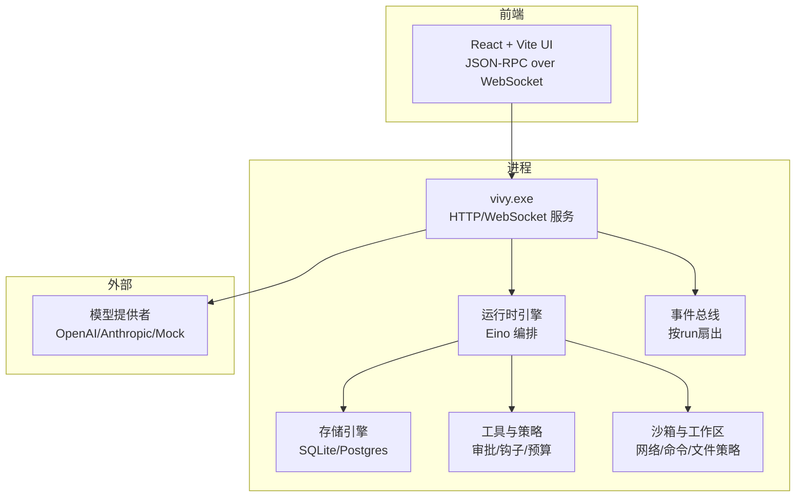
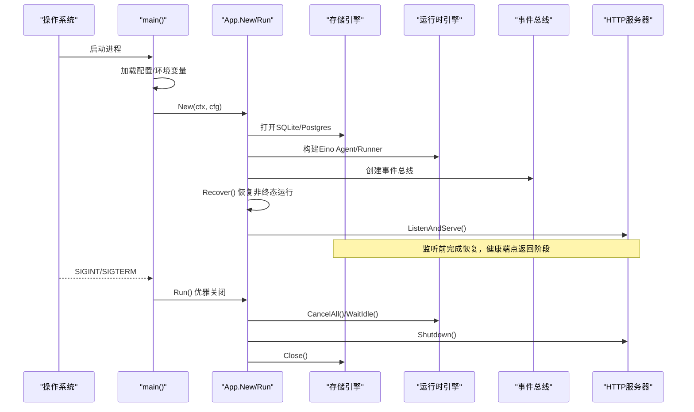
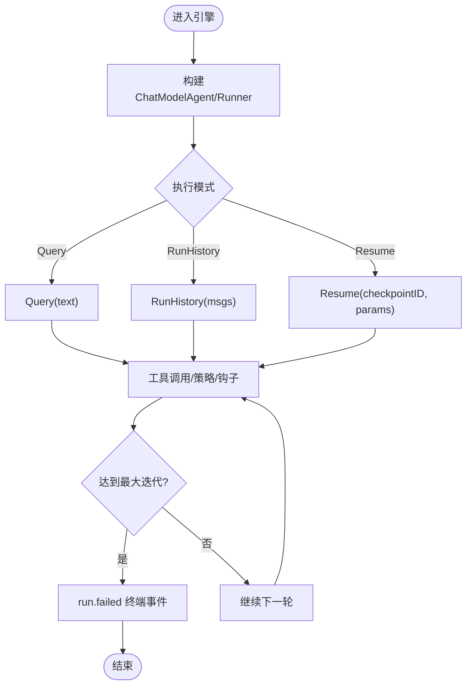
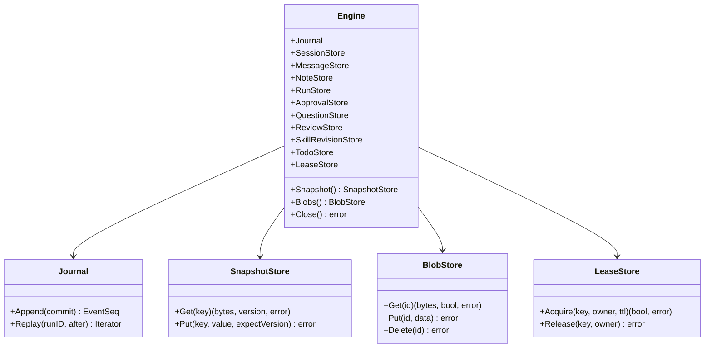
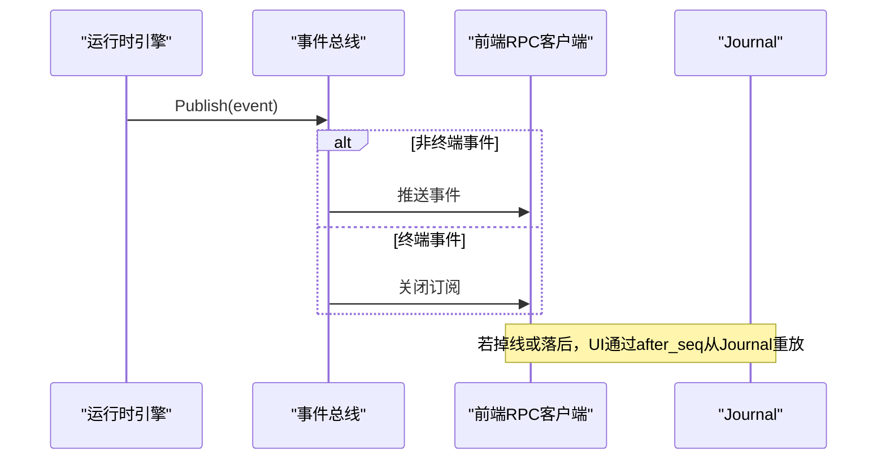
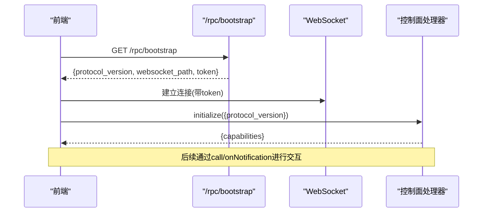
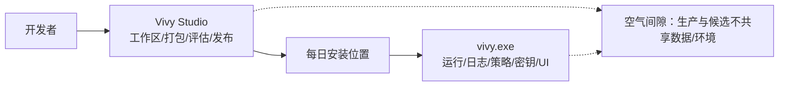
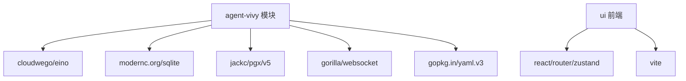

# 项目概述

<cite>
**本文引用的文件**
- [README.md](file://README.md)
- [go.mod](file://go.mod)
- [cmd/vivy/main.go](file://cmd/vivy/main.go)
- [cmd/vivy-studio/main.go](file://cmd/vivy-studio/main.go)
- [internal/app/app.go](file://internal/app/app.go)
- [internal/config/config.go](file://internal/config/config.go)
- [config.example.yaml](file://config.example.yaml)
- [docs/architecture/VIVY-GATEWAY-AND-STUDIO.md](file://docs/architecture/VIVY-GATEWAY-AND-STUDIO.md)
- [docs/AGENT-VIVY-ARCHITECTURE-V0.md](file://docs/AGENT-VIVY-ARCHITECTURE-V0.md)
- [internal/runtime/engine.go](file://internal/runtime/engine.go)
- [internal/storage/contracts.go](file://internal/storage/contracts.go)
- [internal/events/bus.go](file://internal/events/bus.go)
- [ui/package.json](file://ui/package.json)
- [ui/src/lib/rpc.ts](file://ui/src/lib/rpc.ts)
</cite>

## 目录
1. [简介](#简介)
2. [项目结构](#项目结构)
3. [核心组件](#核心组件)
4. [架构总览](#架构总览)
5. [详细组件分析](#详细组件分析)
6. [依赖关系分析](#依赖关系分析)
7. [性能与可观测性](#性能与可观测性)
8. [故障排查指南](#故障排查指南)
9. [结论](#结论)
10. [附录：快速开始与环境搭建](#附录快速开始与环境搭建)

## 简介
Agent-Vivy 是一个基于 cloudwego/eino 框架构建的个人网关 Agent 运行时系统，采用单 Go 模块组织，后端为 Go（Go 1.26+），前端为内嵌的 React + Vite UI。其目标是提供“一键可用”的个人网关：具备会话、运行、事件溯源存储、策略审批、沙箱隔离、插件能力扩展以及本地优先的可审计日志。Vivy（内核/物种）与 Vivy Studio（第一方 IDE 外壳）严格分离：前者负责日常运行与持久化，后者负责开发、打包、评估与发布。

本仓库遵循以下红线与约定：
- Eino 及参考项目类型不得泄漏到 internal/runtime 与 internal/provider 之外的 UI 契约中。
- 密钥绝不持久化；配置仅保存环境变量名，日志、快照、事件负载与测试 fixture 必须脱敏。
- 每次 Run 恰好一个终态事件；事件经 internal/events 总线按 after_seq 游标重放。
- 插件不通过修改引擎安装，必须走 vivy-sdk verify/pack 流程；plugins/hello-fs 是示例用户插件，sdk/ 是插件作者导入窗。
- 默认存储为 SQLite，Postgres 作为第二个 Journal 引擎而非副本集。

**章节来源**
- [README.md:1-107](file://README.md#L1-L107)
- [docs/AGENT-VIVY-ARCHITECTURE-V0.md:33-47](file://docs/AGENT-VIVY-ARCHITECTURE-V0.md#L33-L47)
- [docs/AGENT-VIVY-ARCHITECTURE-V0.md:49-63](file://docs/AGENT-VIVY-ARCHITECTURE-V0.md#L49-L63)
- [docs/AGENT-VIVY-ARCHITECTURE-V0.md:76-85](file://docs/AGENT-VIVY-ARCHITECTURE-V0.md#L76-L85)
- [docs/AGENT-VIVY-ARCHITECTURE-V0.md:87-98](file://docs/AGENT-VIVY-ARCHITECTURE-V0.md#L87-L98)
- [docs/AGENT-VIVY-ARCHITECTURE-V0.md:100-110](file://docs/AGENT-VIVY-ARCHITECTURE-V0.md#L100-L110)
- [docs/AGENT-VIVY-ARCHITECTURE-V0.md:112-122](file://docs/AGENT-VIVY-ARCHITECTURE-V0.md#L112-L122)

## 项目结构
仓库采用“单一 Go 模块 + 内嵌前端”的组织方式：
- cmd：进程入口（vivy.exe 与 vivy-studio）。
- internal：应用装配、配置、领域模型、运行时引擎、提供者适配、工具注册、存储契约与实现、事件总线、RPC 控制面、Studio 服务、Worker 子进程等。
- ui：React + Vite 前端，默认通过 go:embed 内嵌至二进制；也支持 headless 构建以独立静态站点形式部署。
- schemas/fixtures：事件 JSON Schema、Provider Bundle Schema、测试夹具。
- docs：架构决策、实施计划、研究文档与规范。
- plugins/sdk：插件示例与 SDK 工具链。

```mermaid
graph TB
A["cmd/vivy/main.go<br/>启动与生命周期"] --> B["internal/app/app.go<br/>装配与HTTP/RPC"]
B --> C["internal/runtime/engine.go<br/>Eino编排与执行"]
B --> D["internal/storage/contracts.go<br/>存储契约(Engine/Journal/...)]
B --> E["internal/events/bus.go<br/>事件总线"]
B --> F["internal/rpc/*<br/>JSON-RPC控制面"]
B --> G["ui/*<br/>内嵌React+Vite前端"]
H["cmd/vivy-studio/main.go<br/>Studio生命周期工具"] --> I["internal/studiocore/*<br/>工作区/评估/发布"]
```

**图表来源**
- [cmd/vivy/main.go:1-93](file://cmd/vivy/main.go#L1-L93)
- [internal/app/app.go:1-120](file://internal/app/app.go#L1-L120)
- [internal/runtime/engine.go:18-69](file://internal/runtime/engine.go#L18-L69)
- [internal/storage/contracts.go:252-273](file://internal/storage/contracts.go#L252-L273)
- [internal/events/bus.go:10-21](file://internal/events/bus.go#L10-L21)
- [ui/src/lib/rpc.ts:38-99](file://ui/src/lib/rpc.ts#L38-L99)

**章节来源**
- [README.md:68-95](file://README.md#L68-L95)
- [docs/AGENT-VIVY-ARCHITECTURE-V0.md:33-47](file://docs/AGENT-VIVY-ARCHITECTURE-V0.md#L33-L47)

## 核心组件
- 进程入口与装配：cmd/vivy/main.go 负责加载配置、信号处理、启动 internal/app 装配并运行 HTTP/WebSocket 服务；cmd/vivy-studio/main.go 是独立的生命周期工具，管理工作区、打包、评估、发布与安装。
- 配置与边界：internal/config/config.go 提供强类型配置与校验，强制密钥只通过环境变量引用，禁止将敏感值写入配置或持久化。
- 运行时引擎：internal/runtime/engine.go 封装 Eino 的 ChatModelAgent 与 Runner，提供查询、历史回放与断点恢复能力，并通过工具适配器接入策略与钩子。
- 存储契约：internal/storage/contracts.go 定义 Journal、Snapshot/Blob/Lease、Session/Message/Run/Approval/Question/Review/Skill/Todo 等接口，SQLite 为默认实现，Postgres 为可选服务端后端。
- 事件总线：internal/events/bus.go 提供按 run 维度的事件扇出与订阅，终端事件关闭流，慢消费者将被丢弃并由 RPC 层从 Journal 重放。
- 前端与控制面：ui 使用 React + Vite，通过 ui/src/lib/rpc.ts 建立 WebSocket JSON-RPC 连接，消费 /rpc/bootstrap 获取 token 与协议版本，后续通过 initialize 协商能力。

**章节来源**
- [cmd/vivy/main.go:19-74](file://cmd/vivy/main.go#L19-L74)
- [cmd/vivy-studio/main.go:1-100](file://cmd/vivy-studio/main.go#L1-L100)
- [internal/config/config.go:1-13](file://internal/config/config.go#L1-L13)
- [internal/runtime/engine.go:48-117](file://internal/runtime/engine.go#L48-L117)
- [internal/storage/contracts.go:55-94](file://internal/storage/contracts.go#L55-L94)
- [internal/events/bus.go:10-21](file://internal/events/bus.go#L10-L21)
- [ui/src/lib/rpc.ts:55-99](file://ui/src/lib/rpc.ts#L55-L99)

## 架构总览
Vivy 采用“个人网关 + 事件溯源 + 安全沙箱”的架构：
- 单模块设计：所有代码位于 agent-vivy 模块，避免多模块耦合。
- 事件溯源：Journal 为产品历史唯一事实源，UI 通过 after_seq 重放事件重建状态。
- 安全沙箱：Workspace 隔离、网络白名单、命令白名单、审批策略与超时控制。
- 提供者抽象：OpenAI/Anthropic 预置 Bundle，密钥通过环境变量注入，Mock 模式用于离线与测试。
- 前后端解耦：默认内嵌 UI，也可 headless 构建后以静态站点形式与后端同机分离部署。



**图表来源**
- [internal/app/app.go:220-313](file://internal/app/app.go#L220-L313)
- [internal/runtime/engine.go:69-117](file://internal/runtime/engine.go#L69-L117)
- [internal/storage/contracts.go:252-273](file://internal/storage/contracts.go#L252-L273)
- [internal/events/bus.go:42-75](file://internal/events/bus.go#L42-L75)
- [ui/src/lib/rpc.ts:55-99](file://ui/src/lib/rpc.ts#L55-L99)

## 详细组件分析

### 进程入口与装配（vivy.exe）
- 启动流程：读取配置（支持 VIVY_CONFIG 覆盖）、解析 provider bundle、打开存储、构建模型与工具、装配运行时引擎与服务、恢复非终态运行、启动 HTTP 服务。
- 优雅关闭：在信号触发时，先停止交互扫描器、取消运行、等待空闲、关闭 HTTP 与存储，确保每个 run 的终止事件被持久化。
- 安全约束：AllowedOrigins 限制跨域访问；当 server.addr 为非回环地址时不允许配置 allowed_origins，防止暴露风险。



**图表来源**
- [cmd/vivy/main.go:23-74](file://cmd/vivy/main.go#L23-L74)
- [internal/app/app.go:63-120](file://internal/app/app.go#L63-L120)
- [internal/app/app.go:316-363](file://internal/app/app.go#L316-L363)
- [internal/app/app.go:470-519](file://internal/app/app.go#L470-L519)

**章节来源**
- [cmd/vivy/main.go:19-74](file://cmd/vivy/main.go#L19-L74)
- [internal/app/app.go:63-120](file://internal/app/app.go#L63-L120)
- [internal/app/app.go:316-363](file://internal/app/app.go#L316-L363)
- [internal/app/app.go:470-519](file://internal/app/app.go#L470-L519)

### 运行时引擎（Eino 编排）
- 引擎职责：封装 Eino 的 ChatModelAgent 与 Runner，提供 Query、RunHistory、Resume 三种执行路径；通过工具适配器注入策略、钩子与结果大小限制。
- 循环保护：MaxToolTurns 限制每轮运行的生成迭代次数，超出则分类为 run.failed。
- 检查点：VersionedCheckpointStore 与 BlobStore 结合，保证中断后可恢复；版本不匹配会 fail-closed。



**图表来源**
- [internal/runtime/engine.go:69-117](file://internal/runtime/engine.go#L69-L117)
- [internal/runtime/engine.go:119-166](file://internal/runtime/engine.go#L119-L166)

**章节来源**
- [internal/runtime/engine.go:18-69](file://internal/runtime/engine.go#L18-L69)
- [internal/runtime/engine.go:69-117](file://internal/runtime/engine.go#L69-L117)
- [internal/runtime/engine.go:119-166](file://internal/runtime/engine.go#L119-L166)

### 存储契约与事件溯源
- 契约设计：Journal 为追加有序日志，Replay 支持 after_seq 游标；Snapshot/Blob/Lease 提供一致性快照、分代写入与租约；其他 Store 承载会话、消息、运行、审批、问题、笔记、技能修订、待办等。
- 一致性保障：Exactly-one-terminal 守卫、乐观并发冲突、租约持有/丢失错误。
- 后端选择：SQLite 默认，Postgres 通过 dsn_env 环境变量注入 DSN，禁止在配置中出现真实凭据。



**图表来源**
- [internal/storage/contracts.go:55-94](file://internal/storage/contracts.go#L55-L94)
- [internal/storage/contracts.go:252-273](file://internal/storage/contracts.go#L252-L273)

**章节来源**
- [internal/storage/contracts.go:11-31](file://internal/storage/contracts.go#L11-L31)
- [internal/storage/contracts.go:55-94](file://internal/storage/contracts.go#L55-L94)
- [internal/storage/contracts.go:252-273](file://internal/storage/contracts.go#L252-L273)

### 事件总线与重放
- 扇出机制：按 runID 维护订阅者集合，Publish 时将事件推送到各订阅通道；终端事件关闭并清理订阅。
- 背压与恢复：若订阅者落后，通道阻塞时会丢弃该订阅者，由 RPC 层从 Journal 按 after_seq 重放，保证无事件丢失。
- 用途：UI 通过 WebSocket 接收事件流，刷新界面；后端内部组件也可订阅关键事件。



**图表来源**
- [internal/events/bus.go:42-75](file://internal/events/bus.go#L42-L75)
- [ui/src/lib/rpc.ts:55-99](file://ui/src/lib/rpc.ts#L55-L99)

**章节来源**
- [internal/events/bus.go:10-21](file://internal/events/bus.go#L10-L21)
- [internal/events/bus.go:42-75](file://internal/events/bus.go#L42-L75)

### 前端与控制面（React + Vite + JSON-RPC）
- 连接流程：前端通过 /rpc/bootstrap 获取协议版本、WebSocket 路径与 token，随后建立 WebSocket 并调用 initialize 协商能力。
- 通信模型：请求-响应与通知并存；断开重连由上层逻辑处理，错误统一封装为 RpcClientError。
- 嵌入与分离：默认内嵌 UI；headless 构建可将静态资源输出到 dist/，通过配置 controlPlaneUrl 指向后端。



**图表来源**
- [ui/src/lib/rpc.ts:55-99](file://ui/src/lib/rpc.ts#L55-L99)
- [internal/app/app.go:325-348](file://internal/app/app.go#L325-L348)

**章节来源**
- [ui/package.json:1-82](file://ui/package.json#L1-L82)
- [ui/src/lib/rpc.ts:1-155](file://ui/src/lib/rpc.ts#L1-L155)
- [internal/app/app.go:325-348](file://internal/app/app.go#L325-L348)

### Vivy 与 Vivy Studio 的分离设计
- 职责划分：Vivy（species）负责日常运行、Journal、策略、审批、密钥解析与驻留 UI；Vivy Studio 是独立应用，负责工作区、打包、评估、发布与安装，不触碰生产 Journal。
- 数据隔离：评估候选进程拥有独立数据目录、监听地址与环境，与生产实例空气间隙。
- 发布流程：人类确认 release 后，install 到每日安装位置，下次启动生效；不支持热替换。



**图表来源**
- [docs/architecture/VIVY-GATEWAY-AND-STUDIO.md:27-61](file://docs/architecture/VIVY-GATEWAY-AND-STUDIO.md#L27-L61)
- [docs/architecture/VIVY-GATEWAY-AND-STUDIO.md:192-215](file://docs/architecture/VIVY-GATEWAY-AND-STUDIO.md#L192-L215)
- [docs/architecture/VIVY-GATEWAY-AND-STUDIO.md:287-305](file://docs/architecture/VIVY-GATEWAY-AND-STUDIO.md#L287-L305)

**章节来源**
- [docs/architecture/VIVY-GATEWAY-AND-STUDIO.md:27-61](file://docs/architecture/VIVY-GATEWAY-AND-STUDIO.md#L27-L61)
- [docs/architecture/VIVY-GATEWAY-AND-STUDIO.md:192-215](file://docs/architecture/VIVY-GATEWAY-AND-STUDIO.md#L192-L215)
- [docs/architecture/VIVY-GATEWAY-AND-STUDIO.md:287-305](file://docs/architecture/VIVY-GATEWAY-AND-STUDIO.md#L287-L305)

## 依赖关系分析
- 模块与框架：单一 Go 模块，依赖 cloudwego/eino 及其扩展；前端依赖 React、Vite、TanStack Router、Zustand 等。
- 存储依赖：SQLite（纯 Go，无需 CGO）与 Postgres（通过 jackc/pgx）；Postgres 通过环境变量注入 DSN。
- 网络与协议：gorilla/websocket 用于 WebSocket；JSON-RPC 控制面在前端与后端之间传递事件与指令。
- 配置与验证：yaml.v3 解析 YAML；严格的字段校验与白名单策略。



**图表来源**
- [go.mod:1-59](file://go.mod#L1-L59)
- [ui/package.json:14-70](file://ui/package.json#L14-L70)

**章节来源**
- [go.mod:1-59](file://go.mod#L1-L59)
- [ui/package.json:14-70](file://ui/package.json#L14-L70)

## 性能与可观测性
- 流式缓冲与事件载荷上限：stream_buffer、max_event_payload_bytes 限制内存占用与传输体积。
- 上下文与历史限制：max_context_bytes、max_history_messages、max_tool_result_bytes 控制模型输入规模。
- 运行预算：max_run_events、max_model_calls、max_run_tool_calls、max_run_retries 限制单次运行树开销。
- 审计与日志：Slog JSON 日志；AuditHook 将工具调用与策略评估写入审计；事件携带结构化原因类别便于定位。
- 健康检查：/healthz 返回运行阶段，便于容器编排与健康探测。

[本节为通用指导，不直接分析具体文件]

## 故障排查指南
- 启动失败：
  - 配置校验失败：检查 server.addr、storage.backend、providers.active、tools.enabled、sandbox 等必填项与取值范围。
  - Provider 密钥缺失：确认环境变量名称与值已设置；错误信息会提示变量名但不包含密钥。
  - 存储不可用：SQLite 路径不存在需创建目录；Postgres DSN 未通过环境变量注入会报错。
- 运行异常：
  - 循环过多：检查 max_tool_turns 是否过小；查看 model.request 事件与工具调用链。
  - 审批卡住：检查 pending approvals 列表与过期时间；必要时手动决定或取消。
  - 事件丢失：确认订阅者是否落后；通过 after_seq 从 Journal 重放。
- 前端连接问题：
  - /rpc/bootstrap 返回非 JSON 或无法建立 WebSocket：检查后端是否启动、CORS 与 allowed_origins 配置。
  - 断开重连：前端会在断开时清空 pending 并触发 close 监听，上层应实现重连逻辑。

**章节来源**
- [internal/config/config.go:341-527](file://internal/config/config.go#L341-L527)
- [internal/app/app.go:316-363](file://internal/app/app.go#L316-L363)
- [internal/events/bus.go:42-75](file://internal/events/bus.go#L42-L75)
- [ui/src/lib/rpc.ts:55-99](file://ui/src/lib/rpc.ts#L55-L99)

## 结论
Agent-Vivy 以“个人网关”为核心目标，通过事件溯源、策略审批与安全沙箱，提供了可审计、可恢复、可扩展的 Agent 运行时。单模块设计与 Eino 编排使系统简洁而强大；Vivy 与 Vivy Studio 的职责分离确保了日常运行稳定与开发分发可控。对于初学者，可从 quick start 入手体验；对于有经验的开发者，可深入 internal/runtime、internal/storage、internal/events 与 ui 控制面，按需扩展工具、提供者与策略。

[本节为总结性内容，不直接分析具体文件]

## 附录：快速开始与环境搭建
- 环境要求：Go 1.26+、Node.js 22+、pnpm；GOPROXY 设置为国内代理。
- 常用任务：
  - just setup：下载依赖
  - just build：编译全部
  - just test：运行测试
  - just ci：格式化、vet、测试与前端安装/类型检查/构建
  - just run：启动后端（健康端点 :8787）
  - just dev：一键拆分循环（后端 :8787 + Vite :3015）
  - just build-split：构建无头后端与独立静态 UI
  - just docker-up：单容器镜像，SQLite 卷，主机 127.0.0.1:8787
- 配置要点：
  - 复制 config.example.yaml 为 config.yaml，勿写入真实密钥。
  - 通过环境变量注入 Provider 密钥与 Postgres DSN。
  - 如需分离部署，设置 server.allowed_origins 与前端 controlPlaneUrl。

**章节来源**
- [README.md:21-66](file://README.md#L21-L66)
- [config.example.yaml:1-136](file://config.example.yaml#L1-L136)